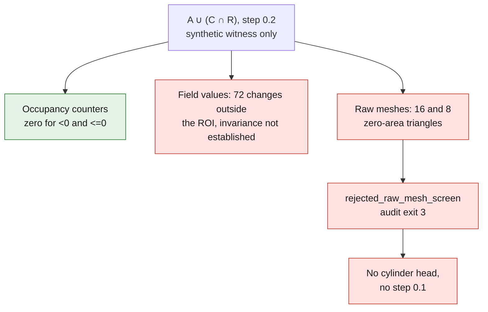

# Local witness — direct union, rejected state

This variant keeps the sources and results of the first formulation. It builds
`A ∪ (C ∩ R)`, with `C = closing(A)` and an exploratory radius of 1 unit. The
identity with `A ∪ ((C \ A) ∩ R)` holds for all sets, without assuming
`C ⊇ A`. It does not imply that their discrete fields, or their extracted
meshes, are identical. The addition `(C \ A) ∩ R` is kept as a diagnostic: it no
longer takes part in building the candidate.

Only the synthetic witness of two stepped cylinders was run, at step 0.2, on
Kali, with 2 CPUs / 4 GiB and a 300 s limit. No private cylinder head, no second
step of 0.1 and no new B-Rep were processed.

## Kept result

The native calculation finished in 4.737 s; process memory peak: 179,163,136
bytes. Of 1,157,625 comparable native nodes, the occupancy change counters
outside the ROI, at the protections, for loss of the initial gas and for contact
of the addition with the mask boundary are all zero, for `<0` and `<=0`. The
modified nodes number 1,944 and 828 respectively. These are grid results, not a
proof of invariance of a continuous surface.

The audit of the field values detects **72 changes outside the ROI**, with a raw
maximum of **0.0012884736061096191 native length unit**. No value change is
detected at the sampled protections. The invariance of the field outside the ROI
is therefore not established, despite the unchanged signs.

| Raw mesh | Triangles | Exactly zero area | Edges of incidence > 2 |
|---|---:|---:|---:|
| Before | 89,708 | 0 | 0 |
| After | 90,028 | 16 | 16 |
| Diagnostic addition | 4,464 | 8 | 8 |

**The witness stays rejected before any cylinder head.** The auditor reindexes
only exactly identical coordinates, keeps all faces and explicitly disables
repair when searching for components (`repair=False`). These components are not
interpreted as cavities. No edge of incidence one allows concluding here that
there are physical holes. The residual between the difference of the global
triangle volumes and the volume of the diagnostic addition is
**3.618739229847031 unit³**, unexplained. The three isosurfaces are discretized
separately; this residual stays visible and is not used as proof of
conservation.

## Mandatory erratum for reading the receipt

The [erratum file](interpretation-erratum.json) is bound to the exact digests of
the executed program and of its receipts, which are not rewritten. The fields
named `native_voxel_units` and the `times_h` conversions of the initial receipt
are mislabeled. In this runtime, `RenderImplicit` receives the world coordinates
via `vecToMM`, stores the callback distances without dividing by the step, then
`GetZSlice` copies the values directly. The C ABI and the C# `SignedDistance`
mode add no conversion. **The delta must not be multiplied by 0.2.** For this
synthetic witness, these lengths are the world units named MM by PicoGK; this
does not certify the scale of the private scan. This field delta is not a bound
on the surface displacement.

Another correction concerns the explanation of the runtime: the Booleans call
`RebuildGrid`, but the pinned version returns immediately at lines 773–776. It
therefore does not run its reconstruction. That reconstruction cannot be
presented as the demonstrated cause of the observed defects. The
[exact sources and checked lines](interpretation-erratum.json) allow both
corrections to be verified.

## Fields and reproducibility

Six native fields are recorded in `native-fields.vdb`: `original_A`,
`closing_C`, `ROI_R`, `C_intersect_R`, `direct_candidate`, `diagnostic_added`.
The rereading verifies the names, the count, the metadata scale and access to
non-empty fields. **The identity of the values before/after serialization was
not checked.**

`Program.cs` is frozen in its executed version to ensure provenance; its old
unit labels require the erratum. `criteria.json` contains the preregistered
guards, `audit_mesh.py` the raw audit, and
`tests/test_picogk_direct_union_junction.py` the contract and set-identity
tests. A native exit 0 means only that the occupancy guards passed, with the SDF
and the mesh still to be examined. The independent audit returned 3
(`rejected_raw_mesh_screen`).

This witness proves no G1 junction, no fluid/thermal performance and no
printability. Any eventual cleaned extraction must remain a separate
counter-trial, without erasing the rejection of the raw mesh.
