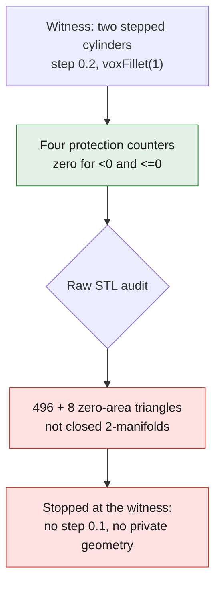

# PicoGK local junction — witness before any cylinder head

This module tests a **local morphological closing** of exploratory radius
1 unit, via `voxFillet(1)` (offset +1 then −1). It creates no exact B-Rep
fillet, no G1 proof, no M64 body, and no thermal or manufacturing validation.
The mask keeps the initial gas volume and allows only a local addition. It is
not enough to establish the protection: the occupancies are compared after all
the Booleans. Runtime reading correction: `RebuildGrid` is called but disabled
by an unconditional `return` in the pinned revision; no effective
reconstruction must be attributed to it.

`criteria.json` fixes the screens before execution: zero change outside the ROI
and at the protected interfaces, zero loss of the initial gas and zero contact of
the addition with the mask boundary, for both conventions `<0` and `<=0`. The
check covers all nodes of the enclosing native grid, not a continuous surface
between these nodes. The 0.2/0.1 resolution comparison would be a stability
screen, not a proof of asymptotic convergence.

## Result of September 8, 2026

The witness, made of two stepped coaxial cylinders, was run at 0.2, on the pinned
x86 runtime, 2 CPUs / 4 GiB and a 300 s timeout. It finished in 6.233 s with a
process peak of 129,445,888 bytes. Of 1,157,625 nodes, 828 change from outside to
gas; the four protection counters stay at zero for both zero conventions.

**The batch is nevertheless stopped at the witness**, before 0.1 and before the
private geometry. The counter-check of the raw STLs finds 496 triangles of
exactly zero area in the candidate and 8 in the addition; these meshes are not
closed 2-manifolds. There is no edge of incidence one, but there are incidences
greater than two: this therefore does not prove the presence of physical holes.
The many components containing these degenerate triangles are not interpreted as
cavities. No triangle is deleted by the auditor.



The residual between the difference of the global volumes and the volume of the
Boolean addition is 0.860474131 unit³, unexplained. The volumes are integrated
from the oriented triangles, not taken from `CalculateProperties`, which remeshes
the field. The STLs and receipts are preserved; the intermediate fields of this
pass were not serialized to VDB. A resumption would require a new traced run,
not a supposed reuse of nonexistent fields.

## Files and execution

- `Program.cs` accepts only `--witness` as long as this guard is failing.
- `criteria.json`: criteria and source of the future intake, not used.
- `audit_mesh.py`: indexes only exactly identical vertex coordinates, then
  checks the original triangles, without rounding or repair.
- `tests/test_picogk_local_junction.py`: preregistered contracts and a
  regression of the auditor with a zero triangle and an inverted orientation.

In the existing image (no download or new rental):

```sh
dotnet build LocalJunction.csproj -c Release -o bin \
  -p:UpstreamRoot=/upstream -p:GeneratePackageOnBuild=false --ignore-failed-sources
timeout --signal=TERM --kill-after=10 300 \
  dotnet bin/LocalJunction.dll --witness criteria.json NOUVEAU_DOSSIER 0.2
```

The network was disabled. The build succeeded with a NU1900 warning: the NuGet
vulnerability lookup was unavailable, not the packages already present. A
native exit 0 means only that the occupancy counters pass. The independent
audit returns 3 and blocks the rest.

## Independent complements, without overwriting the initial receipts

`audit_surface_topology.py` checks connectedness through all incidences, the
vertex links and collinearity by exact dyadic integer arithmetic, without
repair. The three STLs each form a single component; the candidate stays
rejected with 552 invalid links. The old group counts from `Trimesh.split` are
not an inventory of cavities.

`exact_zero_countertrial.py` removes only the float64 cross products that are
zero, in an in-memory copy, without writing any STL. 340 non-manifold edges
remain on the candidate: this counter-trial is rejected as well.

The historical label `raw_native_SDF_units="voxel_units_sign_only"` is
incorrect. For this witness, `GetZSlice` copies the values in the geometric
units of the callback, without conversion. The sign counters remain valid; no
continuous distance result was established by this receipt. The program and its
execution receipts remain unchanged for traceability.

Pinned references: [PicoGK, closing operation](https://github.com/leap71/PicoGK/blob/0e6cf6b6f4993ec16dbcd72d8f27f26b999980f3/Base/Voxels.cs#L613-L643)
and [kernel, Booleans, slices and disabled reconstruction](https://github.com/leap71/PicoGKRuntime/blob/0f26321c18ed878a7820ef769c38fd5d49d39242/Source/PicoGKVdbVoxels.h).
