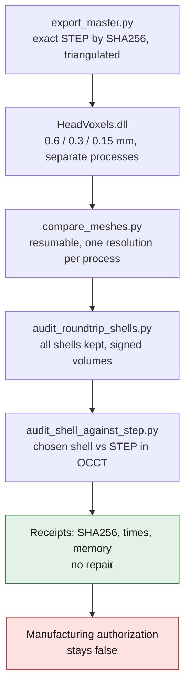

# PicoGK — geometric qualification of the existing body

This application uses the LEAP 71 kernel pinned in
`containers/m64-leap71/sources.lock`. It processes a triangulated copy of the
private four-bore body, **without modifying the master STEP or applying a new
registration to it**. The scale remains the assumption 1 scan unit = 1 mm; the
engine interfaces do not become measured M64 dimensions.

## Reproducible batch

1. `export_master.py`: import the exact STEP by its SHA256, check its state and
   triangulate with a declared absolute deflection; keep the derived files and
   reports in the private directory, outside Git/Docker.
2. `/opt/m64/HeadVoxels.dll INPUT_STL NOUVEAU_REPERTOIRE RESOLUTION_MM`:
   import without transformation, voxelize, then export the mesh. Launch three
   independent processes at 0.6 / 0.3 / 0.15 mm and limit each duration.
3. `compare_meshes.py`: compare these three outputs to the same triangulated
   master, checking topology, volume, boxes and sampled distances in both
   directions. Perform the sampled detection of thin zones and save each
   resolution separately. Produce the comparative view and a section in a step
   separate from the large audit.

The Python counter-check requires `numpy`, `scipy`, `trimesh`, `rtree`,
`matplotlib` and `networkx` (construction of the section contours). Its Python
environment is isolated in `/opt/geometry-qa` of the research PicoGK image; the
versions actually used accompany the audit receipt. The image witness uses only
synthetic shapes, offline. The Matplotlib render can show depth-sorting defects
on coplanar faces: an opaque VTK view distinguishes them from geometric defects.

PicoGK import-export remeshes the surfaces: the resulting meshes do **not**
replace the B-Rep master of the interfaces and machined seating faces. A small
global volume error is not enough to qualify these interfaces.

## Resumable audit and memory

`compare_meshes.py --output NOUVEAU_DOSSIER --query-chunk-size 32` creates a
context bound to the SHAs of the inputs, receipts and sources, to the Python and
library versions, and to the parameters. It runs the master and then each of the
three resolutions in a fresh process. Each complete result is written atomically
as private JSON before the next; time and peak RSS are kept.

After an interruption, the same command with `--resume` reuses only the intact
checkpoints whose entire context matches. A change of mesh, code, versions, seed
or batch size prohibits resuming the same directory. Old outputs without context
are not promoted to checkpoints. The inside/outside classification fallback is
explicitly seeded, and persistent ambiguities are rejected and counted, not
resolved at random.

The batches bound the proximity and ray queries, **not** the size of the mesh or
of its spatial index. On the 13.7-million-triangle mesh, run **without
`--render`**, with external memory/time limits and supervision of the process
group. After an abrupt stop of the parent, verify that no orphan worker remains
before resuming: the directory lock alone does not demonstrate it. The
Matplotlib render has no separate checkpoint and must not condition the saving
of the fine calculation.

The tests cover a failure after the first resolution, resumption, corruption, a
changed context, a concurrent lock and query invariance, including a forced
inconsistent parity branch. They do not qualify the part.

## Oriented shells and counter-test against the STEP

`audit_roundtrip_shells.py` rereads a candidate bound explicitly to its SHA, to
the master and to the voxelization receipt. It keeps all shells, counts their
triangles and integrates their signed volumes; the sum is compared to the volume
of the whole mesh. A small negative shell is neither deleted according to its
size nor interpreted automatically as physical porosity.

`audit_shell_against_step.py extract` locates a chosen shell and records its
exact triangles **privately**. Its `occt` mode uses these triangles as a
distinct closed operand, oriented positively for the diagnostic, then computes
region minus STEP and region intersected with STEP. It checks validity and the
volume balance at the declared OCCT tolerances, with an additional fuzzy value
of zero. It never inverts the source mesh. The witnesses cover inner, outer and
crossing regions.

The [resumption receipt](../../evidence/picogk-roundtrip-checkpoint-audit-20260907.json)
keeps the complete audit, the defects and the counter-test of the micro-shell at
0.3. The 0.15 shells are not equated with this result. The
[void propagation](../picogk-connectivity/README.md) is a distinct check:
surface connectedness and volume connectivity are not equivalent. None of these
commands repairs or authorizes manufacturing.

## Distinct morphological diagnostic

The program also builds a morphological opening of radius 0.75 mm (erosion then
dilation), intersected with the initial volume. The difference
`opening-sensitive-features.stl` shows the details sensitive to this operation.
It also includes corners and edges: **it is not a measurement of walls thinner
than 1.5 mm**, nor an LPBF support calculation, nor a proposal to remove
material. The diagnostic stays separate from the round-trip mesh.

The sampled normal chords of the Python counter-check do not give a continuous
minimum-thickness bound either. The results guide the later local
reconstruction; no global smoothing, new envelope, oil gallery or functional
surface is imposed without an authorized zone.

## Delivery and limits

The receipt of each run binds the input and outputs by SHA256, states the
resolution, the process times and memory, and keeps the manufacturing
authorizations false. A failure writes `FAILED.json`; an old output directory is
never overwritten. A successful run constitutes neither CFD/CHT, nor a strength
calculation, nor a print simulation of this cylinder head.

The publishable image contains only the software and synthetic witnesses. The
STEP, its STL, the derived variants and the views remain private. Publication of
a digest, its exact anonymous download, the x86 smoke and the SSH checks are
required before rental; the duration and cost are bounded by the manifest and an
external destruction guard.
