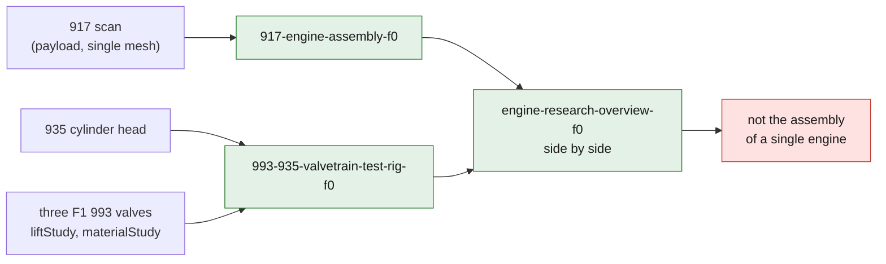

# F0 Omniverse engine assemblies

This directory composes the available geometries into lightweight OpenUSD scenes
without inventing a mechanical compatibility. The scans and the generated USD
stay under `work/`, outside Git; only the configuration, the generator and the
method reports are versioned.

## Scenes

- `917-engine-assembly-f0.usda` loads the 917 scan as a `payload`. At this stage
  the scan remains a single mesh: the scene prepares its future decomposition,
  but does not claim to already contain an independent case, cylinders or
  accessories.
- `993-935-valvetrain-test-rig-f0.usda` keeps the 935 cylinder head in a
  separate comparison rig and references the three F1 993 valves. Each valve
  exposes `liftStudy` at 0, 2, 5 and 10 mm and `materialStudy` for the
  documentary variants steel, Ti-6Al-4V and INCONEL 751.
- `engine-research-overview-f0.usda` shows the two scenes side by side. This
  file is not the assembly of a single engine.



The valve positions are a presentation exploded view. They do not represent the
seat axes, which are still unknown. The materials use only `UsdPreviewSurface`
and study metadata: no thermal, elastoplastic, fatigue or contact law is
assigned.

## Whole-engine research layout v1 (`993-engine-assembly-v1.usda`)

Status: **research layout, not fitment.** The wave-2 whole-engine scene is
generated by `source/build_engine_scene.py` from the manifest
`assembly-engine-v1.json` (stdlib-only Python, no `pxr` required; rebuilds are
byte-identical). The manifest is the single source of truth: every prim is
either a real reference to an existing asset under
`twins/catalogue-parts/usd/` (where the BOM maps one) or an honestly labelled
box proxy sized from BOM-sourced envelope dimensions, and every item prim
carries `m64:fidelity`, `m64:sourceCitation` and `m64:redesignInterest`. The
engine-local coordinate frame is documented in the layer header and in
`m64:coordinateFrame`; positions are layout hypotheses on that frame, not
measured or fitted positions. BOM lines with no scene prim are declared, with
reasons, in the manifest's `bom_coverage` block.

```bash
python3 twins/omniverse-engine-assembly/source/build_engine_scene.py
python3 twins/omniverse-engine-assembly/source/validate_engine_scene.py \
    --report work/reports/engine-scene-v1.json
```

The stdlib validator checks the manifest contract (including BOM-line coverage
against the read-only `twins/m64-engine-system/bom/m64-bom-v1.json`), the USDA
structure, the evidence attributes on every prim, and that every `references`
arc resolves on disk. `validate_usd_assemblies.py` additionally reruns the
scene checks (`engine_v1_*`) when it runs with OpenUSD inside the pipeline
image. Per-zone coverage (real asset / box proxy / envelope-unknown) is
tabulated in [`status.md`](status.md). Passing these checks means the scene is
complete, honestly labelled and loadable structure; it never means any part is
dimensionally accurate, fitted, tested, safe or released.

## Reproducible generation

The image is pinned by digest and was built on GitHub before execution:

```bash
twins/omniverse-engine-assembly/run_pipeline.sh
```

The command converts the three STEP files with `usd-convert-cad`, then generates
the scenes with OpenUSD. No NVIDIA secret or Content Agents service is required
for this deterministic milestone.

GPU rendering is a separate check. Since the scenes use local references and
payloads, the temporary copy sent to OVRTX must be flattened if the render
package does not carry its dependencies. This operation never modifies the
source scenes. Always enable pixel inspection and reject a uniform PNG. The run
report is kept in
[`../../docs/reports/omniverse-engine-assembly-f0-2026-09-01.md`](../../docs/reports/omniverse-engine-assembly-f0-2026-09-01.md).

## Next steps

1. segment the 917 scan into traceable components without modifying the raw
   scan;
2. measure physical datums and confirm the scale;
3. create the real seat and guide axes on an identified target cylinder head;
4. replace the display properties with material cards that depend on
   temperature and process;
5. add contacts, joints, collisions and load cases only after the interfaces are
   proven;
6. rerun Material Agent and then Physics Agent once NIM access is valid, before
   any final SimReady conformance.
