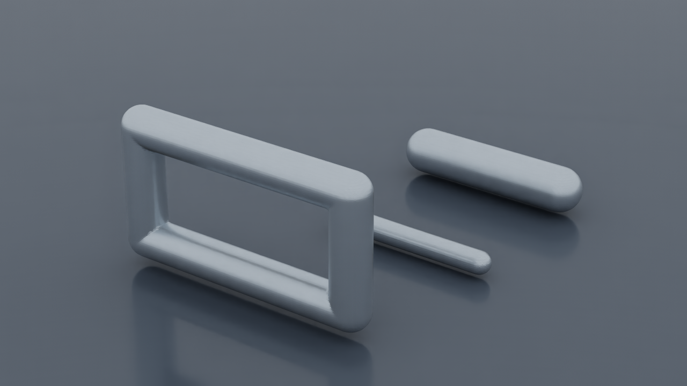

# Témoins exécutés sur Vast

L'instance **53246885**, issue de l'offre **49181720** sur la machine **44690**,
a passé le préflight matériel, les témoins CPU, la requête Qwen, l'appel d'outil
OpenClaw, le rendu OVRTX sur GPU 3 et l'édition/sauvegarde/reconnexion
Omniverse, puis les trente minutes simultanées, le 28 septembre 2026. Le
[résumé](summary.json) distingue ces résultats des validations encore absentes.

| Contrôle | Résultat mesuré |
|---|---|
| GPU | 4 × NVIDIA RTX PRO 6000 Blackwell Server Edition, 97 887 Mio chacune ; pilote 580.95.05 |
| CPU | Quota effectif de 122,88 CPU |
| Mémoire | Plafond cgroup observé : 1 101 706 297 344 octets |
| Disque de travail | 1 073 714 896 896 octets libres au préflight |
| Vulkan | Quatre GPU énumérés au préflight ; fonctionnement interactif prouvé ensuite par la vidéo native Kit |
| NVENC | 30 images H.264 à 1920 × 1080, 30 images/s, sur le GPU 2 ; sortie nulle, code de succès |
| Témoin CPU complet | Code 0 en 4,977 s ; PicoGK, géométrie Python, aller-retour STEP, FreeCAD, présence Gmsh/CalculiX/OVRTX |
| Témoin natif conservé | Code 0 en 1,528 s ; 3 660 triangles avant et après aller-retour STL |
| Volume PicoGK | 520,4744 mm³ contre 523,5988 mm³ analytiques ; erreur relative 0,5967 % |
| Offset PicoGK | Offset positif de 1 mm : volume de 901,338 mm³ |
| Qwen API | Réponse exacte `STATION_QWEN_OK`, HTTP 200, requête de 14,397 s |
| OpenClaw | Appel CLI de 95,514 s ; cycle de preuve de 108,127 s ; tâche créée et 21 empreintes d’artefacts vérifiées |
| OVRTX | 64 étapes, code 0 en 261,357 s ; PNG de 1280 × 720 ; 772 observations du processus uniquement sur le GPU 3 |
| Omniverse | Sélection native, translation de 10 mm, sauvegarde USD et reconnexion ; 746 nouvelles images à 1920 × 1080 |
| Vidéo Kali2 | 132 images décodées à 1920 × 1080 avec le client final ; services actifs après fermeture SSH |

Le [préflight brut](gpu-preflight/preflight.json), son
[contexte NVENC](gpu-preflight/context.json) et le [journal Vulkan](gpu-preflight/vulkan.log)
sont conservés. Le journal NVENC vide correspond à une exécution sans erreur
avec le niveau de journalisation `error` ; il n'est pas une preuve WebRTC.

Le [rapport CPU](cpu-smoke/result.json), son [journal](cpu-smoke/cpu-smoke.log)
et le [rapport natif](native-witness/report.json) décrivent les témoins logiciels.
Le STL de sphère est conservé ici car son empreinte n'est identique à aucun STL
du dossier de construction. Les [références et empreintes](artifact-provenance.json)
permettent de retrouver chaque fichier source du relevé privé sans publier de
chemin personnel. Ces témoins ne qualifient aucune pièce pour fabrication.

Lors du relevé initial à **20:36:04 UTC**, les services HTTP sur Kali2 répondaient `200` sur les ports
locaux `18789` et `8088`. L'API `18000/v1/models` n'était pas prête ; les poids
Qwen étaient encore en chargement. La [preuve de contrôle](control-plane.json)
consigne aussi la synchronisation détachée avec `station-worker` vers Kali2 :
processus `1489013`, dernière copie réussie à `20:35:17 UTC`, destination privée,
aucune suppression et aucun suivi de liens. Sa limite est le
**29 septembre à 00:12:16 UTC**, identique à l'échéance de location.

La [preuve du nouveau contrôle complet](make-check.json) atteste `make check`
avec code **0** sur Kali2 : **3 219 tests principaux**, dont 148 ignorés ;
3 496 invocations en comptant les répétitions des 32 suites ; **569 documents
Markdown contrôlés, aucun lien cassé**. Les seules lignes de synthèse utiles du
journal figurent dans [make-check-summary.log](make-check-summary.log). Son
empreinte intégrale est enregistrée dans le reçu ; le journal complet reste
privé. Ce contrôle précède l'ajout de ce dossier de preuves.

La [preuve Qwen](qwen-api/response.json) confirme le modèle attendu et son
contexte maximal annoncé de **262 144 tokens**. L'API est devenue disponible à
20:55:39 UTC ; la réponse témoin a été confirmée à 20:55:55 UTC. Cela ne mesure
pas une requête qui remplit entièrement ce contexte.

Le [reçu OpenClaw](openclaw/tool-call.json) prouve ensuite la création effective
de `openclaw-proof-205858` par l'outil `station-task demo`, via le gateway de
Kali2. La tâche était absente avant le tour, puis terminée avec 21 empreintes
vérifiées. Les **133 143 tokens d'entrée et 1 090 de sortie sont cumulés sur le
tour d'agent** ; ils ne représentent ni une fenêtre unique ni une facture.
Les compteurs de coût déclarés par l'outil ont été exclus du reçu public. À
21:02:31 UTC, le gateway et le tunnel étaient actifs sans redémarrage, et le
dashboard répondait HTTP 200.

Le [rendu OVRTX](ovrtx-gpu3/summary.json) a produit l'image ci-dessous. Les
[observations du processus](ovrtx-gpu3/execution.json) associent le PID `11170`
uniquement à l'UUID du GPU 3, avec un maximum observé de 3 539 Mio. La sélection
n'est donc pas déduite du seul paramètre CUDA. Le témoin ajouré et les deux
coupons ont été vérifiés visuellement.

Le premier essai avait été arrêté après 79,139 s à cause des droits d'écriture
du cache. La [correction runtime](ovrtx-gpu3/runtime-permissions-fix.json)
accorde au worker les seuls répertoires `cache` et `mdl/omniverse_exts`. La
recette source reprend ce correctif ; **le digest publié initialement ne
l'inclut pas encore**. Le rendu réussi concerne l'instance après cette
correction explicite.

Les six sondes UDP publiques depuis Mac et Kali2 n'ont reçu aucune réponse ;
les deux machines peuvent partager le même accès Internet. Ce résultat prouve
un échec depuis notre réseau, pas une faute identifiée du fournisseur. Le [repli média borné via SSH](omniverse-ui/summary.json) a permis la
connexion avec le client WebRTC officiel. Les captures conservent la
[scène initiale](omniverse-ui/picogk-kit-native-initial.png), la
[sélection native](omniverse-ui/picogk-kit-selected-pointer.png), le
[déplacement de 10 mm](omniverse-ui/picogk-kit-10mm-proof.png) et la
[reconnexion](omniverse-ui/picogk-kit-reconnected.png). La vérification USD
confirme `(10, 0, 0)` mm sur `/World/bracket_witness` dans le
[fichier sauvegardé](omniverse-ui/working.usda). La scène originale a la même
empreinte que le [témoin de construction](../build/station-demo-cpu/station-assembly.usda),
donc elle n'est pas dupliquée. La [réouverture native File/Open](omniverse-ui/ui-reopen-final.json)
a ensuite été vérifiée : l'arbre de scène est rechargé et la sélection montre
toujours les 10 mm. Pendant cette ouverture, la file de transport a atteint sa
borne de 8 Mio et fermé la connexion média. La reconnexion a réussi sans
redémarrer Kit ni Qwen ; cet incident reste dans le reçu.

Le [reçu de reconnexion](omniverse-ui/picogk-client-native-reconnected.json)
conserve l'avertissement du premier essai, puis le succès après 34,445 s et
746 nouvelles images à 1920 × 1080. La [vidéo native sur Kali2](omniverse-ui/kali2-native-video.json)
a ensuite décodé 132 images avec l'empreinte finale du client ; sa
[capture](omniverse-ui/kali2-native-video.png) montre toujours les 10 mm. Les
[services après fermeture SSH](omniverse-ui/services-after-ssh.json) restent
actifs avec `linger=yes`. Après le [redémarrage ciblé du tunnel média](omniverse-ui/services-after-media-restart.json),
le tunnel et le relais restent actifs ; le compteur du relais vaut un
redémarrage, celui du tunnel Qwen reste à zéro. Les diagnostics ICE bruts
ne font pas partie des preuves publiées.

Le [premier essai simultané](soak-attempt-1/report.json), commencé à
**21:02:18 UTC**, a échoué après 15,401 secondes sur le seuil de mémoire GPU : le GPU 0 atteignait 96 088 Mio sur
97 887 Mio, soit environ 98,16 %. Aucun OOM n'a été observé et les quatre
requêtes Qwen ont réussi. Le contrôleur a identifié le repli à 0,95 du script
de base lorsque l'environnement Docker n'était pas transmis par SSH ; le
lanceur fixe désormais explicitement `GPU_MEMORY_UTILIZATION=0.90`. La
[correction](qwen-api/memory-fix.json) conserve les empreintes avant/après.
L'[API après correction](qwen-api/response-after-memory-fix.json) a répondu
exactement `STATION_QWEN_90_OK` en 4,175 s à 21:09:01 UTC. Les
[paramètres effectifs](qwen-api/effective-config.json) confirment 0,90, TP2,
262 144 tokens et quatre séquences. Les capacités annoncées au démarrage
ne constituent pas un essai de quatre contextes complets. Le [nouvel appel OpenClaw](openclaw/tool-call-after-memory-fix.json) a confirmé
l'exécution native de `station-task status`, avec code 0 et tâche terminée :
17,281 s pour la CLI, 19,027 s pour le cycle de preuve. Les 22 617 tokens
d'entrée et 231 de sortie sont cumulés sur le tour. Le deuxième essai
d'endurance a été interrompu par le contrôleur vers 21:21:30 UTC pour
diagnostiquer une absence de réponse dans le dashboard utilisateur. Il avait
traité 12 requêtes et 5 pipelines en 168,669 s, avec un maximum de mémoire GPU
de 91,026 %, selon le relevé du contrôleur. Il n'est pas déclaré en échec de
ressources. L'utilisateur a confirmé la reprise des réponses ; le troisième
essai a commencé à **21:25:42 UTC**, avec une fin attendue à **21:55:42 UTC**.
Le [rapport final du troisième essai](soak/README.md) est **PASS** après
1 800,176 s : 120 requêtes, 53 chaînes et 121 mesures, sans OOM ni redémarrage.
La VRAM maximale atteint 91,992 % et la RAM disponible minimale 793,404 Go.
Les [1 219 fichiers vérifiés sur Kali2](soak/kali2-sync-verification.json)
comprennent les géométries, les reçus et les rendus. Les compteurs Qwen portent
sur les requêtes du test ; les mesures de ressources incluent aussi l’activité
utilisateur éventuellement présente. Le [deuxième rapport brut](soak-attempt-2/report.json)
et ses événements conservent l’interruption opérateur séparément. Quatre
requêtes courtes simultanées ne valident pas quatre contextes pleins de 262 144 tokens.

La [couche finale construite](image-hotfix/final-image.json) conserve les 74
couches du digest initial et en ajoute quatre, soit 924 103 689 octets non
compressés. Elle embarque le client final, le relais média corrigé, la limite
Qwen explicite et les permissions OVRTX. Le [témoin CPU/configuration/worker](image-hotfix/cpu-config-smoke.log)
passe en 3,827 s ; les ports restent `22/tcp` et `47998/udp`, et les sept champs
de configuration comparés sont inchangés. Les [empreintes sources](image-hotfix/source-sha256.json)
et le [journal de construction](image-hotfix/build.log) sont conservés. Cette
preuve de construction ne vaut pas publication de la nouvelle image.

À la demande explicite de conserver la station allumée, une [nouvelle couche persistante](image-hotfix-persistent/final-image.json)
a ensuite été construite : image `4f58a4e28ab7…`, témoin CPU/configuration
PASS en 4,157 s et 74 couches initiales inchangées. Elle conserve les bornes de
transport et permet le mode explicite `--persistent`. Les [services relevés après fermeture SSH](omniverse-ui/persistent-services-after-ssh.json)
n'ont plus de condition d'échéance. Le tunnel Qwen garde son PID.
La [politique active](keep-running.json) remplace la limite initiale par un
maintien en fonctionnement sans destruction automatique ; le prix observé
est de 6,237037 USD/h, environ 149,69 USD/jour hors transferts, et la facture
réelle reste inconnue. Les preuves initiales bornées restent historiques.
La [copie permanente des résultats](sync-persistent.json) utilise toujours
`rsync` vers Kali2 toutes les 60 secondes. Les quatre redémarrages transitoires
pendant la libération de l'ancien verrou sont enregistrés ; le service est
ensuite stable, sans suppression ni liens suivis.

Le [calcul CPU sur Kali1](kali1-cpu/summary.json) réutilise le runtime extrait
de l'image qualifiée : archive de 39 775 617 octets, 221 fichiers vérifiés,
aucune installation système. Le processeur i5-1235U dispose de 12 CPU logiques ;
les calculs utilisent un scope limité à deux CPU, 2 Gio, zéro swap, 128 tâches
et 300 secondes, avec `nice 10`. Les essais de 40 et 60 mm passent en 1,268 et
1,494 s, avec des pics de mémoire de 119,4 et 123,1 Mio ; un troisième essai
local de 50 mm passe aussi. Aucun OOM n'est relevé et les PID des services
SSH, Docker, Tor et OpenClaw sont inchangés après les deux premiers essais.

Le [lancement natif depuis Kali2](kali1-cpu/kali2-triggered/execution.json)
réussit ensuite en 1,220 s et collecte automatiquement les huit artefacts
vérifiés. Le [lanceur SSH](../../../../deploy/intel/kali1-picogk.py) appelle le
[calcul borné](../../../../deploy/intel/run-picogk-cpu.sh), puis `rsync` sans
suppression ni suivi de liens. L'IP directe était inaccessible avant
authentification ; le port local `2221` de Kali2 passe par le contrôleur Mac,
avec vérification de la clé d'hôte et identité dédiée native. Aucune clé
privée n'a été transférée. Le [bloc TOOLS OpenClaw](../../../../deploy/vast/station/station-TOOLS.md)
a été ajouté en préservant le texte existant, sans redémarrer le gateway.
Les STL complets, sources et licences sont conservés sur Kali2 ; les rapports
et empreintes sont publiés ici, sans dupliquer les maillages. Cette voie CPU
ne constitue aucune validation physique ou autorisation d'impression.

Le [contrôle de livraison](make-check-delivery.json) passe sur le contrôleur
macOS : **3 230 tests principaux**, 148 ignorés, 3 507 invocations sur 32 suites.
Ses 572 documents Markdown n’ont aucun lien cassé ; les preuves ajoutées après
ce contrôle ont fait l’objet d’une nouvelle vérification des liens. Le correctif
des métadonnées `capability[]` et `wwwauth[]` de Git 2.53 a été ajouté pendant
le contrôle complet, puis ses **cinq tests ciblés ont été relancés avec succès**.
Le [journal public réduit](make-check-delivery-summary.log) conserve les bilans ;
l’empreinte du journal complet est enregistrée dans le reçu.

La [preuve GitHub native sur Kali2](github-access/proof.json) confirme pour les
deux dépôts autorisés la lecture du README, `git ls-remote` et `git push --dry-run`
avec code 0. Aucune référence distante ni aucun commit n’a été publié par ces
vérifications. Le transport utilise le wrapper OpenBao existant par la liaison
SSH du contrôleur ; aucun redémarrage du gateway n’a été nécessaire.

Les fichiers de ce dossier sont indexés dans [SHA256SUMS](SHA256SUMS).
