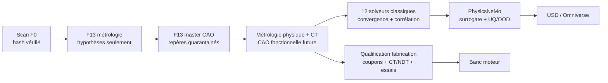
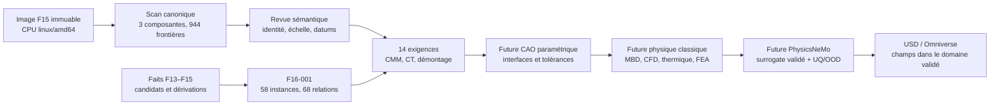

# Jumeau de référence du moteur Porsche 917

## Portée actuelle

Ce dossier transforme le scan local du carter avec cylindres en un jumeau
extérieur reproductible. Le fichier OBJ et tous les maillages dérivés restent
hors Git. Seuls le code, la méthode et les résultats textuels vérifiables sont
versionnés.

Deux familles de sortie sont prévues :

- un modèle `F1_exterior_reference` qui conserve les surfaces mesurables du
  scan et les interfaces répétées détectées ;
- un modèle `display_print` fermé et simplifié pour fabriquer une maquette
  non fonctionnelle.

Le porteur du projet confirme que le fichier est sous licence ouverte et
réutilisable, mais l'identifiant standardisé de cette licence n'est pas encore
archivé. Indépendamment de ce droit, son instruction est de conserver le scan
et tous ses dérivés géométriques hors Git. Ni l'identification exacte ni
l'échelle en millimètres ne sont confirmées. Aucun artefact ne doit être présenté comme
une pièce moteur fonctionnelle, compatible 993 ou prête pour un essai.

## Exécution

```bash
PYTHON=/chemin/vers/python \
  twins/reference-917-engine/run_pipeline.sh \
  raw-scans/917-engine/original/917-engine-case-with-cylinders.obj \
  work/917-engine/pipeline
```

La sortie lourde reste sous `work/`. Le pipeline refuse un fichier source dont
l'empreinte ne correspond pas au scan inspecté.

Le brut est rangé sans modification sous
`raw-scans/917-engine/original/917-engine-case-with-cylinders.obj`. Une copie
USD sans instanciation, adaptée au rendu et aux étapes de simulation, est
produite hors Git sous `work/simready-results/917/`. La conversion contrôlée
contient un maillage de 7 397 573 points et 2 465 877 faces, en axe Z avec
`metersPerUnit = 0.001`; son enveloppe est de 1002,175 × 768,275 × 739,765
unités de scène. Ces métadonnées ne suffisent toujours pas à confirmer l'échelle
physique du scan.

Un rendu OVRTX 768 × 768 a été obtenu dans le conteneur SimReady. L'assignation
automatique de matière par le Material Agent reste bloquée par un refus 403 de
l'endpoint NVIDIA et ne doit pas être présentée comme validée. Le maillage brut,
les USD et les images restent hors Git en attendant la clarification des droits.

## Livrables visés

| Livrable | Usage | Limite |
|---|---|---|
| copie OBJ vérifiée | traçabilité | stockage local uniquement sur instruction du propriétaire |
| maillages allégés | inspection et mesures | unité OBJ non confirmée |
| composants séparés | revue carter/cylindres/éléments isolés | classification à valider visuellement |
| rapport d'interfaces | axes, diamètre et pas des cylindres | dépend de la qualité des ouvertures visibles |
| proxy STEP | assemblage et encombrement | géométrie simplifiée |
| STL étanche | maquette d'exposition | interdit pour un usage moteur |
| domaines CFD locaux | développement de la chaîne numérique | pas de conditions moteur inventées |

## Résultats F1 actuels

Le maillage de travail à 600 000 triangles conserve le scan avec un écart p95
de 0,107 unité OBJ sur 50 000 points échantillonnés. La version à 250 000
triangles atteint 0,244 unité p95 et reste réservée à la visualisation.

La détection par projection, transformée de Hough et ajustement RANSAC retrouve
deux rangées de six ouvertures :

- diamètre visible moyen : 86,63 unités OBJ, plage 85,20 à 87,76 ;
- pas longitudinal régulier : 118,03 sur la rangée positive et 117,87 sur la
  rangée négative ;
- coupure centrale après le troisième cylindre : 172,84 et 173,89 ;
- décalage longitudinal médian entre rangées : 36,94.

Ces valeurs décrivent les ouvertures visibles du scan. Elles ne prouvent ni le
diamètre d'alésage, ni la variante du moteur, ni une unité millimétrique.

## Réingénierie mesurée F11–F13

Le programme de réingénierie sépare maintenant explicitement la référence
visuelle, la CAO, la physique et la fabrication :



Les livrables versionnés sont :

- [programme et niveaux de preuve](../../docs/917_REENGINEERING_PROGRAM.md) ;
- [métrologie conditionnelle du scan](../../docs/917_SCAN_METROLOGY_F13.md) ;
- [master paramétrique carter–cylindre–culasse](../../docs/917_PARAMETRIC_INTERFACE_F13.md) ;
- [registre des douze cas solveurs classiques](../../docs/917_CLASSICAL_SOLVER_CASES_F13.md) ;
- [stratégie de fabrication et qualification](../../docs/917_MANUFACTURING_VALIDATION_F13.md).

Le STEP F13 contient 25 solides de repérage et reste sous `work/`, hors Git. Il
sert uniquement à superposer et contrôler l'implantation des douze ouvertures.
Il n'est ni une pièce, ni une CAO de définition. Le niveau vérifié du moteur
reste F0 tant que l'identité, l'échelle et les datums n'ont pas été confirmés
sur du matériel physique identifié.

## Criblage de culasse 2V/4V F29

F29 publie une étude de concept indépendante du scan : quatre solides de
culasse issus d'une feuille blanche couvrent les scénarios 5,0 l atmosphérique
et 5,374 l turbo, chacun en architecture 2V et 4V. Les STEP canonisés, les STL,
les figures et les rapports SHA-256 sont consultables dans le
[paquet de preuves F29](evidence/f29/README.md). La méthode, les équations de
criblage, les choix provisoires de matière et de distribution ainsi que les
limites sont détaillés dans la
[documentation F29](../../docs/917_CLEAN_SHEET_HEAD_F29.md).

```bash
make 917-clean-sheet-head-f29
make 917-clean-sheet-head-f29-check
make 917-clean-sheet-head-f29-figures
```

La branche 4V obtient le meilleur score de criblage dans les deux scénarios,
avec une aire effective moyenne estimée supérieure, mais aussi des pénalités de
masse de soupapes, de contrainte de plaque et de température. Ces résultats
sont des indicateurs analytiques simplifiés : ils ne constituent ni un
rendement moteur, ni une CFD, ni une FEA, ni une corrélation banc. Le
[rapport consolidé](evidence/f29/validation-report.json) maintient donc à
`false` la validation du jumeau, la fabrication et le démarrage moteur. Les
deux images publiées sont des aperçus CAD, pas des rendus Omniverse.

## Calcul EF de référence du deck F31

F31 fait franchir à la comparaison 2V/4V un niveau supplémentaire : douze
maillages Gmsh et trente-six résolutions CalculiX séparent pression, dilatation
thermique et cas combiné. Les résultats, convergence et bilans sont publiés
dans le [paquet de preuves F31](evidence/f31/README.md), avec la
[méthode complète](../../docs/917_HEAD_REFERENCE_CAE_F31.md).

La version 4V garde le gain d'aire effective de F29 et réduit légèrement le
déplacement du deck dans ce modèle, mais augmente la contrainte P95 de 9,0 % en
atmosphérique et de 14,5 % en turbo. Elle reste donc la branche de performance
à développer, sous condition de renforcer les chemins de charge et de refaire
le calcul sur une culasse fonctionnelle mesurée.

Le modèle EF est volontairement défeaturé parce que les STEP/STL complets F29
ne produisent pas encore un volume Gmsh raffiné robuste. Il ne contient ni les
ailettes, ni les vrais conduits, sièges, guides, précharges ou contacts. Une
FEA convergée de ce coupon est une preuve de chaîne solveur et de comparaison,
pas une validation de fabrication ou de démarrage moteur.

## Assemblage fonctionnel complet F1

Une nomenclature paramétrique distincte du scan reconstruit les familles
fonctionnelles identifiables du moteur Type 912. Elle comprend 31 prototypes
STEP et STL d'inspection, instanciés 275 fois dans un stage OpenUSD : carters,
vilebrequin et huit paliers, pistons, axes, segments, bielles, cylindres,
culasses individuelles, soupapes et ressorts, quatre arbres à cames et leur
entraînement central, admission, double allumage, lubrification à carter sec,
refroidissement, échappement et accessoires. La variante `917_30_turbo` active
en plus deux turbocompresseurs et deux plénums ; la variante par défaut
`type_912_4_5_na` les masque.

```bash
make 917-complete-assembly
```

La chaîne utilise l'image immuable
`ghcr.io/cluster2600/3dprinting993-simready-workflow@sha256:41965aa48548481473a63f4d0277599b93cf4870d2e1f833099dd4e8e146d2f3`.
Elle exige d'abord un prévol SimReady vert, génère les géométries avec
Build123d, convertit chaque prototype STEP en USDC, compose le stage instancié,
puis contrôle les deux variantes. Les sorties restent localement sous
`work/917-complete-engine/`; aucun scan, STEP, STL ou USD n'est versionné.

Le résultat est un assemblage d'encombrement et de topologie, pas une CAO
constructeur. Les dimensions sourcées sont séparées des hypothèses de placement
(longueur de bielle, longueur des arbres, enveloppe des turbos, notamment).
L'affectation de matériaux, les joints physiques et PhysicsNeMo sont
intentionnellement absents tant que les interfaces, masses, alliages, profils de
came, jeux et cas de charge ne sont pas mesurés. Il est interdit d'utiliser ces
proxies pour fabriquer ou faire tourner un moteur.

Les principales sources de recoupement sont l'analyse moteur
[auto motor und sport](https://www.auto-motor-und-sport.de/oldtimer/porsche-917-motor-kraftwerk-ohne-gleichen/),
les [détails techniques Stuttcars](https://www.stuttcars.com/porsche-917-technical-details/),
la synthèse secondaire [kfz-tech](https://www.kfz-tech.de/Buchprojekte/Porsche/917Teil2.htm)
et la fiche officielle du
[Porsche 917/30 Spyder](https://newsroom.porsche.com/de/pressemappen/Porsche-Museum/Porsche-917-30-Spyder.html).

## Cinématique Omniverse F2

La couche F2 ajoute une timeline de 240 images à 24 images/s au-dessus d'un USD
existant. Elle anime le vilebrequin, les quatre arbres à cames, les douze
pistons et bielles ainsi que la distribution. Le calcul bielle-manivelle utilise
la course sourcée de 66 mm ; la longueur de bielle, la numérotation des bancs et
les levées de soupapes restent des hypothèses de visualisation déclarées dans
`kinematics-f2.json`.

```bash
make 917-kinematics-f2 F2_INPUT=/chemin/vers/moteur-enrichi.usd
```

La scène d'essai utilise une gravité nulle et des corps mobiles cinématiques.
Elle sert à contrôler la hiérarchie, la timeline et les déplacements dans
Omniverse. Elle ne simule ni combustion, ni puissance, ni contacts chargés et
ne valide aucune pièce pour la fabrication.

## Détail systèmes F3

La couche F3 complète l'assemblage F2 avec 13 familles et 30 instances
supplémentaires : entraînement du ventilateur, paire conique, pompe d'injection
à douze pistons, douze conduites, filtre, thermostat et refroidisseur d'huile,
arbre intermédiaire de distribution, puis roues, arbres, wastegates et dérivations
des deux turbocompresseurs de la variante `917_30_turbo`.

```bash
make 917-detail-f3 F2_INPUT=/chemin/vers/moteur-f2.usd
```

Les prototypes STEP sont éditables et les actifs USDC restent instanciés dans
une couche non destructive. Les formes, dimensions et routages non documentés
sont explicitement des hypothèses d'encombrement. Cette couche ne permet ni
fabrication, ni calcul de lubrification ou d'injection, ni validation de
jeux, de débit ou de rotordynamique turbo.

## Fluides, électricité et banc virtuel F4

Le contrat `systems-f4.json` décrit quatre domaines séparés : refroidissement
externe, admission, échappement et huile à carter sec. Il décrit aussi un réseau
électrique fonctionnel allant du bus batterie à l'alternateur, au démarreur, aux
deux distributeurs et aux 24 bougies. Les routes sont des topologies et des
proxies de visualisation ; les conduits internes, sections, longueurs, pertes de
charge, caractéristiques électriques et conditions aux limites ne sont pas
connus. `PhysicsNeMo` est donc réservé à un futur surrogate entraîné après une
référence OpenFOAM contrôlée et des mesures physiques.

Le banc virtuel ajoute une plaque, quatre supports hypothétiques, un
dynamomètre désactivé, un accouplement cinématique, une batterie, une alimentation
carburant, un réservoir d'huile et un arrêt d'urgence. Le prévol autorise
uniquement la visualisation d'un entraînement externe à 120 tr/min, sans
carburant ni allumage :

```bash
make 917-virtual-test-bench

make 917-test-bench-usd \
  F3_INPUT=/chemin/vers/917-engine-detail-f3.usda
```

Le rapport s'arrête volontairement avant tout démarrage avec combustion. Il
énumère les interfaces et données manquantes : supports et accouplement,
démarreur et couronne, batterie et protections, bobines et ordre d'allumage,
alimentation carburant, circuit d'huile, profils de came, inerties et
frottements, combustion, refroidissement, échappement et instrumentation. Ce
fail-closed est le résultat attendu tant que ces éléments ne sont pas mesurés.

## Démarreur, liaison dynamométrique et amorçage d'huile F5

La couche F5 ajoute les enveloppes fonctionnelles encore absentes du banc :
démarreur, pignon, couronne, flasque de sortie, adaptateur dynamométrique,
protection d'accouplement, câbles batterie et masse, alimentation et retour du
réservoir d'huile, puis quatre capteurs d'huile. Elle complète la topologie sans
inventer la denture, les fixations, les sections, les capacités ou les courbes
de pompe.

```bash
make 917-start-support-f5 \
  F4_INPUT=/chemin/vers/917-engine-test-bench-systems.usda

make 917-virtual-test-bench
```

Un passage F5 signifie uniquement que chaque fonction possède un objet ou une
route nommée dans USD. L'amorçage reste bloqué tant que la qualité d'huile, les
débits, les pertes de charge, les soupapes de décharge, les jeux de paliers et
les seuils des capteurs ne sont pas mesurés. Le démarreur et le dynamomètre
restent également désactivés tant que les interfaces et limites de couple ne
sont pas validées.

## Préparation du modèle d'amorçage d'huile F6

Le cas F6 transforme les inconnues de lubrification en entrées explicites d'un
futur réseau hydraulique 0D. Il refuse les valeurs moteur génériques et ne
produit donc actuellement aucune pression fictive :

```bash
make 917-oil-prime-f6
```

Le rapport d'audit énumère les mesures encore nécessaires, notamment la
viscosité en fonction de la température, les courbes des sept pompes, les
sections et longueurs, les pertes du filtre et du refroidisseur, les jeux de
paliers et les seuils d'arrêt. OpenFOAM restera réservé aux passages internes
reconstruits ; PhysicsNeMo ne pourra apprendre qu'après corrélation du réseau
0D, de la CFD et d'essais instrumentés.

## Vidéo d'inspection cinématique F7

La sortie F7 prépare deux couches caméra sur les 241 images de la timeline :
une vue extérieure, puis une vue ouverte masquant les enveloppes qui cachent le
vilebrequin, les pistons, les bielles et la distribution. Le service OVRTX rend
les images sur une RTX et `ffmpeg` les assemble en MP4 720p à 24 i/s :

```bash
make 917-motion-video-stages-f7 \
  F5_INPUT=/chemin/vers/917-engine-start-support-f5.usda

make 917-motion-video-render-f7
```

La vidéo porte une mention incrustée indiquant qu'il s'agit d'un entraînement
cinématique à sec, sans combustion, charge ni pression calculée. Elle reste sans
audio afin de ne pas suggérer un régime moteur physiquement simulé. Les 31
familles reçoivent aussi un matériau `UsdPreviewSurface` déterministe pour le
rendu. Ces couleurs sont des hypothèses visuelles ; elles ne constituent ni une
identification historique d'alliage, ni des propriétés physiques de calcul.

## Liaisons, étanchéités et conduits F8

La couche F8 transforme les connexions encore implicites en quatre contrats
mesurables et contrôlés localement :

- `mechanical-connections-f8.json` inventorie 18 groupes et 119 instances de
  liaisons fixes, guidées, tournantes, engrenées ou montées sur le banc ;
- `sealing-interfaces-f8.json` inventorie 29 groupes et 194 interfaces
  d'étanchéité, y compris les joints feu, huile, admission, échappement et turbo ;
- `ducts-f8.json` inventorie 21 groupes et 106 conduits, en signalant notamment
  l'absence actuelle du domaine carburant F4, de la distribution du plénum, des
  conduites d'huile turbo et du reniflard ;
- `external-interfaces-f8.json` ferme le registre à 6 interfaces externes
  nommées, toutes sans géométrie ni condition aux limites libérée.

La correction topologique F8.1 sépare les guides des 12 soupapes d'admission et
des 12 soupapes d'échappement, distingue l'admission atmosphérique de l'entrée
des deux compresseurs, relie les deux sorties de turbine à l'extraction du banc
et explicite les raccords de la chaîne carburant banc-pompe-conduites-injecteurs.
Ces liaisons décrivent uniquement une connectivité requise ; leurs dimensions,
technologies de joint et conditions de fonctionnement restent à mesurer.

Les nombres décrivent la topologie attendue, pas une nomenclature déclarée
exhaustive. Aucun repère de liaison, jeu, précharge, technologie de joint,
section interne, perte de charge ou condition aux limites n'est inventé. Les
champs de mesure sont donc vides, aucune articulation Physics n'est activée et
aucune frontière de pression n'est libérée.

```bash
make 917-interfaces-f8-check
make 917-interfaces-f8-preflight
```

Le premier contrôle vérifie les références vers les familles F1/F3, les
éléments du banc F4/F5, le registre fermé des interfaces externes, les comptes,
les variantes et les sources. Le second
écrit `work/917-interfaces-f8/input-audit.json` avec la liste déterministe des
mesures manquantes. Même si toutes les entrées sont renseignées, le prévol ne
crée ni joint physique, ni calcul de contact, ni solveur de débit : une revue
d'ingénierie et une étape d'authoring distincte restent obligatoires. F8 ne
contient volontairement aucun objectif de puissance ou modèle de combustion.

## Recoupement documentaire Stuttcars

La page [Porsche 917 Technical Details](https://www.stuttcars.com/porsche-917-technical-details/)
transmise par le porteur du projet confirme comme piste secondaire un flat-12
refroidi par air, deux arbres à cames par banc, une prise de puissance centrale,
un vilebrequin annoncé à 757 mm et des bielles forgées en titane. Elle distingue
notamment 85 × 66 mm pour la première définition et 86 × 70,2 mm pour la version
4 907 cm³. Ces données aident à nommer et paramétrer les futurs organes 917,
mais elles ne donnent ni contour de piston, ni entraxe de bielle, ni profil de
came, ni géométrie des deux turbos du 917/30. Elles ne calibrent donc pas à elles
seules le scan.

## Modèles d'impression

Les deux STL sont reconstruits directement à leur échelle cible avec un voxel
de 0,8 mm, puis nettoyés pour ne conserver qu'un volume principal. Sous
l'hypothèse encore non confirmée `1 unité OBJ = 1 mm` :

| Échelle | Enveloppe candidate | Triangles | Gates géométriques |
|---|---:|---:|---|
| 1:4 | 223,18 × 123,27 × 107,22 mm | 497 738 | étanche, manifold, un seul volume |
| 1:8 | 115,53 × 61,14 × 53,51 mm | 123 324 | étanche, manifold, un seul volume |

`Géométriquement imprimable` ne veut pas dire `prêt à lancer`. Les ailettes,
passages et détails fins exigent encore une revue dans le slicer, une stratégie
de supports et, en résine, un plan intentionnel d'évidement et de drainage.
Les fichiers restent des maquettes statiques non fonctionnelles.

## CFD externe

La peau externe fermée est alignée dans le repère moteur, convertie
provisoirement en mètres et allégée à 300 000 triangles. Le cas OpenFOAM
`snappyHexMesh` construit 130 208 cellules autour de cette peau, dont 118 304
hexaèdres. `checkMesh` bloque toutefois le solveur avec deux contrôles en échec :
21 faces dupliquées, 170 faces à sommets partagés non consécutifs, 76 faces très
asymétriques et 6 111 cellules concaves. Aucune solution d'écoulement n'est donc
produite ou revendiquée.

Le contrôle distant s'exécute séparément :

```bash
twins/reference-917-engine/source/check_external_cfd.sh \
  work/917-engine/pipeline/cfd/external-cooling

python twins/reference-917-engine/source/summarize_openfoam.py \
  work/917-engine/pipeline/cfd/external-cooling/checkMesh.log \
  work/917-engine/pipeline/cfd/external-cooling/cfd-validation.json
```

## Critères avant impression

1. confirmer une dimension physique et l'unité du scan ;
2. choisir une échelle d'impression explicite ;
3. vérifier l'épaisseur minimale, le drainage et le volume de matière ;
4. trancher le STL avec le profil réel de la machine et du matériau ;
5. conserver la mention `display-only` sur chaque export.

## Comparaison 993

Ce scan sert à éprouver les méthodes de gros assemblage, de répétition des
cylindres, de refroidissement externe et d'impression de maquette. Il ne fournit
aucune interface de montage 993. La comparaison dimensionnelle reste bloquée
jusqu'à disposer d'un moteur 993 nommé, de ses entraxes et registres mesurés,
ainsi que d'une échelle confirmée pour les deux jeux de données.

## Branches de géométrie et de cinématique F10

F10 corrige une ambiguïté des scènes F1 à F3 : masquer les turbos ne transforme
pas un moteur 85 × 66 mm en 917/30. Le contrat
`variant-configurations-f10.json` crée donc deux branches sans `engineVariant`
partagé :

- `type_912_4_5_na`, avec alésage/course 85 × 66 mm et cylindrée calculée de
  4 494,205 cm³, recoupés par les sources secondaires AMS, kfz-tech et
  Stuttcars ;
- `917_30_turbo_5374`, avec 90 × 70,4 mm et 5 374,385 cm³ calculés. Les
  5 374 cm³ sont documentés par Porsche ; les 90 × 70,4 mm viennent de la
  source secondaire AMS.

Chaque branche reconstruit ses propres proxies de piston et de cylindre à
partir de l'alésage, possède sa propre course cinématique et produit ses propres
stages géométrie, cinématique puis détail F3 sous
`work/917-variant-geometry-f10/`. La branche atmosphérique exclut réellement les
familles turbo et plénum ; la branche 917/30 les compose avec les organes F3 de
suralimentation. Il ne s'agit plus d'un simple commutateur de visibilité.

```bash
make 917-variant-geometry-f10-check
make 917-variant-geometry-f10
```

La deuxième commande exige un prévol de conversion SimReady vert, puis utilise
les images Docker immuables existantes pour Build123d, STEP, USDC et OpenUSD.
Les STEP, STL, USD et rapports générés restent hors Git sous `work/`.

La portée dimensionnelle reste volontairement étroite. F10 ne change réellement
que le diamètre visuel des pistons/cylindres dérivé de l'alésage et la course de
l'animation. Le corps, les manetons et les contrepoids du vilebrequin restent le
même proxy visuel ; une course de 70,4 mm dans la timeline ne constitue pas la
reconstruction dimensionnelle d'un vilebrequin de 917/30. La longueur de bielle
de 132 mm, le profil de piston, les chambres, les cames, les routages et les
jeux restent des hypothèses explicitement non sourcées. Les source IDs F1 sont
conservés avec les sources propres à l'alésage/course afin de ne pas perdre la
provenance de la topologie, des familles et du scan.

Les validateurs refusent les chemins de stage partagés, une cote sans source,
un retour au variant-set de visibilité, une course différente du contrat, une
branche atmosphérique contenant des organes turbo ou tout gate physique,
fabrication, combustion ou puissance passé prématurément à vrai. F10 est une
séparation de visualisation et de cinématique ; il ne prouve ni jeux, ni masses,
ni inerties, ni contacts, ni fonctionnement, ni 1 600 HP.

## Réingénierie physique et comparaison 2V/4V F11

Le programme complet, sa boucle de corrélation et la frontière entre solveurs
de référence, PhysicsNeMo et Omniverse sont décrits dans
[`docs/917_REENGINEERING_PROGRAM.md`](../../docs/917_REENGINEERING_PROGRAM.md).

F11 recentre le travail sur les douze culasses individuelles du moteur 917. Le
scan disponible couvre le carter et les cylindres vus de l'extérieur ; il ne
contient pas une géométrie mesurée des chambres, conduits, sièges, guides ou
culasses. La culasse scannée de 935 et les proxies de soupapes 993 sont donc
explicitement exclus comme géométrie 917. Ils peuvent seulement servir à
éprouver une méthode hors du modèle 917.

Le contrat `reengineering-contract-f11.json` maintient deux variantes moteur :

- le Type 912 4,5 L atmosphérique ;
- le 917/30 5,374 L biturbo, dont les 1 600 hp restent une exigence documentaire
  à démontrer, et non un résultat de simulation.

Pour chacune, la branche `917_2v_baseline` décrit 2 soupapes par cylindre,
soit 24 soupapes moteur. La branche `917_4v_concept` décrit 2 admissions et
2 échappements par cylindre, soit 48 soupapes, mais n'invente ni diamètre, ni
angle, ni levée, ni commande. Elle exige une CAO paramétrique indépendante et
sera comparée à la 2V avec les mêmes conditions aux limites.

La présélection matière retient seulement deux candidats de culasse LPBF à
caractériser, AlSi10Mg et AlF357. Aucun gagnant n'est déclaré avant calculs
thermiques et thermomécaniques corrélés et coupons produits avec la machine,
l'orientation et le traitement finaux. Les soupapes et ressorts ne sont pas des
pièces à imprimer : admission titane et échappement INCONEL 751 restent des
candidats fournisseur, tandis que le ressort reste une famille acier
chrome-silicium spécialisée à dimensionner depuis les profils de came, masses,
pressions gaz, températures et régimes mesurés.

L'audit est lancé par :

```bash
make 917-reengineering-f11
```

Il écrit `work/917-reengineering-f11/readiness.json`. Avec le manifeste local
d'intégrité livré dans le dépôt et sans autre preuve d'ingénierie, le résultat
attendu est `F0_source_integrity` : le hash du scan brut local est recalculé et
les scènes F10 sont reconnues comme hypothèses
visuelles séparées, mais le maillage CFD externe reste bloqué, aucune physique
de culasse n'est calculée, aucun matériau n'est sélectionné et aucune impression
métal, mise en route ou revendication de puissance n'est autorisée.

Le passage aux niveaux suivants demande successivement l'identité et l'échelle,
un scan ou CT des vraies culasses 917, les géométries 2V et 4V, les profils de
came et courbes de ressorts, les chargements NA et turbo, des solveurs classiques
convergés, une corrélation physique, puis la qualification LPBF et les essais
instrumentés. PhysicsNeMo peut ensuite accélérer les calculs comme surrogate ;
il ne remplace ni la CFD/FEA de référence, ni le banc de flux, ni le banc moteur.

Chaque preuve F11 pointe vers un manifeste JSON typé qui lie un claim, un actif,
une variante, des artefacts re-hashés, une méthode et des critères d'acceptation.
La réutilisation d'un même manifeste ou artefact entre claims incompatibles est
refusée. Ce contrôle empêche les passages accidentels mais ne constitue pas une
chaîne de confiance : même un dossier F6 auto-déclaré garde fabrication,
impression métal, démarrage, 1 600 hp et entraînement PhysicsNeMo à `false` tant
que les signatures, parseurs solveur/banc et autorités externes ne sont pas
qualifiés.

## Inventaire canonique et train mobile F14–F16

Les itérations F14 à F16 remplacent progressivement les hypothèses visuelles par
des contrats reproductibles, sans promouvoir le moteur au-delà de l'intégrité
de sa source :

- [F14](../../docs/917_DIMENSIONAL_SKELETON_F14.md) limite la géométrie aux
  guides dimensionnels sourcés et aux occurrences non placées ;
- [F15 scan](../../docs/917_SCAN_SEGMENTATION_F15.md) exécute l'inventaire du
  binaire canonique dans une [image CPU immuable](../../docs/917_OBJ_METROLOGY_CONTAINER_F15.md) ;
- [F15 mécanique](../../docs/917_MECHANICAL_CYCLE_CLOSURE_F15.md) ferme seulement
  les identités algébriques puissance–travail–couple–BMEP ;
- [F16-001](../../docs/917_KINEMATIC_INTERFACE_READINESS_F16.md) construit le
  registre du carter, du vilebrequin, des huit paliers, des douze cylindres,
  bielles, axes et pistons, sans inventer leurs coordonnées.



L'exécution F15 confirme 1 282 880 sommets, 2 465 879 triangles, trois
composantes de surface et 101 809 arêtes ouvertes. L'OBJ ne contient aucun
objet, groupe ou matériau nommé ; sa segmentation mécanique ne peut donc pas
être déduite de métadonnées. F16 génère 58 instances sémantiques et 68 relations
inactives, mais zéro coordonnée, solide, joint, animation ou échantillon
PhysicsNeMo. Cette frontière empêche de transformer silencieusement un scan
extérieur incomplet en moteur prétendument fonctionnel ou imprimable.

## Réseau de stations F38

Le premier bilan admission–moteur–échappement bi-variante est documenté dans
[`docs/917_GAS_PATH_NETWORK_F38.md`](../../docs/917_GAS_PATH_NETWORK_F38.md).
F38 relit hors réseau l'identité de masse F33, calcule le devoir thermique requis
à partir d'états prescrits et ferme l'identité d'arbre turbo par bissection. Il
publie séparément la perte mécanique turbo sans lui inventer de destination
thermique. L'absence d'entrée directe de la cible dans F38 est vérifiée, mais
F34 conserve une ascendance indirecte et un seed de dimensionnement inverse :
l'indépendance complète reste fausse. La cible est exprimée en hp mécaniques,
distincts des PS/ch métriques. F38 lie aussi la décision F34a de conserver un
cœur strictement air/huile et refuse toute équivalence géométrique entre le
4,5 L F35 et le candidat NA 5,374 L F33. Les maps turbo, la dynamique 1D, la
corrélation banc, le démarrage, la fabrication et toute preuve de puissance
restent explicitement bloqués.

Une image CPU F38 minimale, standard-library et sans clé API accompagne ce
réseau. Son smoke est reproductible sur Docker Desktop et sur un nœud Intel
Linux natif ; la recette GHCR vérifie en plus provenance, SBOM et accès anonyme
par digest avant de considérer l'image exploitable sur Vast.

## Réseau instationnaire 0D/1D F39

La suite est cadrée dans
[`docs/917_UNSTEADY_NETWORK_F39.md`](../../docs/917_UNSTEADY_NETWORK_F39.md).
F39 sépare les capacités 0D des cylindres, plénums et collecteurs des conduits
1D compressibles. L'incrément F39 exécute avec Aeolus1D 0.3.3 un cas NA
`motored` de 720° : 12 cylindres 0D, 27 conduits 1D, 3 jonctions, 48 soupapes
physiques issues de la tête clean-sheet F29 4V et 24 ports équivalents.
Injection et combustion sont désactivées ; aucun couple ni aucune puissance
n'est calculé. La branche biturbo, ses arbres et ses wastegates restent une
topologie future. Le rapport stationnaire F38 peut servir de comparaison ou
d'amorce ; il n'est pas une solution instationnaire ni une mesure de banc.

La première exécution reste un `screening_proxy`. Les longueurs, sections et
volumes internes de F8 ne sont pas mesurés, les profils complets de came et
tables `CdA` manquent, et aucune carte compresseur/turbine, inertie rotor ou loi
wastegate n'est intégrée. Le F35 atmosphérique 4,5 L à 85 × 66 mm ne doit pas
être confondu avec le candidat F33 NA à 90 × 70,4 mm ; le F33 turbo moderne à
rapport 9,5 reste également distinct du 917/30 historique à rapport 6,5.

L'interface prévue est :

```bash
make 917-unsteady-network-f39-test
make 917-unsteady-network-f39
make 917-wave-action-f39-image
```

Le contrat est `twins/reference-917-engine/unsteady-network-f39.json`, le
runner `twins/reference-917-engine/source/run_unsteady_network_f39.py` et les
sorties restent sous `work/917-unsteady-network-f39/`. Le solveur est destiné
au CPU et peut tourner sur le nœud Intel sans GPU ni clé API NVIDIA. L'image
est verrouillée à
`ghcr.io/cluster2600/3dprinting993-wave-action-f39@sha256:742569a45becdd00b9f8d32b057156e68d0bb0489cef1fa97d2e6543fce096a3`.
Son workflow `linux/amd64` a validé le smoke hors réseau, la provenance, le
SBOM et l'accès anonyme au manifeste. Cela rend le runtime reproductible sur
Intel ou Vast, sans valider le modèle moteur qu'il exécutera.

Aeolus1D est un projet MIT récent encore alpha : le smoke du tube à choc de Sod
prouve seulement son runtime CPU `amd64`, pas le modèle 917. Le JSON demeure
l'autorité numérique. Un overlay USD aval peut exposer dans
Omniverse les stations, séries temporelles et classes de provenance sans créer
de géométrie, collision ou physique PhysX. Une animation USD ne prouve ni le
fonctionnement du moteur ni les 1 600 hp ; cette puissance reste une exigence
de conception jusqu'à corrélation indépendante sur banc instrumenté.
