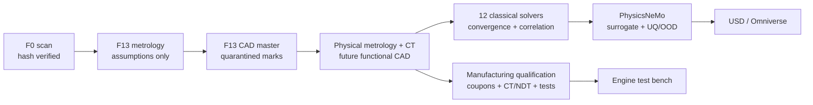
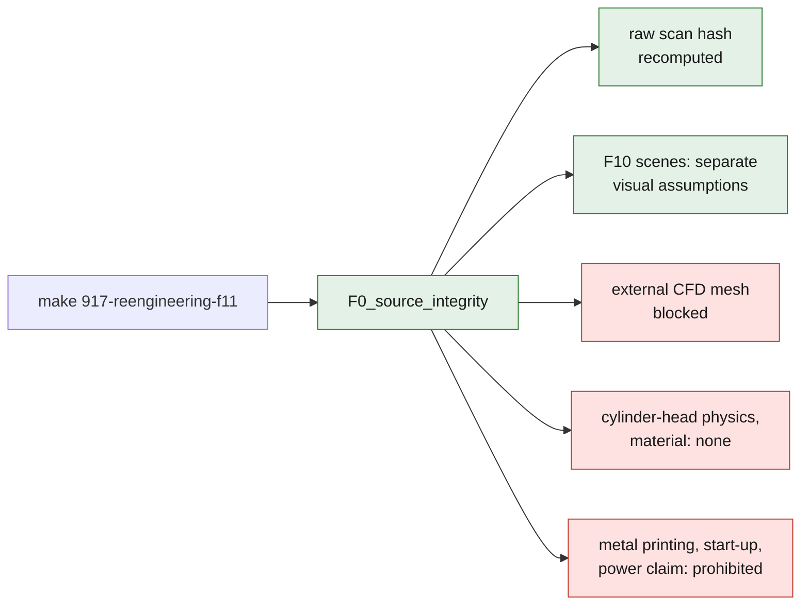
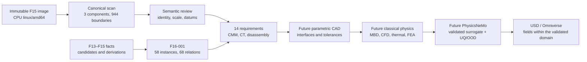

# Porsche 917 engine reference twin

> **Archived line.** The 917 work is retired as a product and kept as a
> numerical regression: it can be used to replay the calculations, reuse the
> test cases and read what was attempted, not to make a part. See
> [ARCHIVE.md](../../ARCHIVE.md). Metal printing and engine start remain
> prohibited.

## Current scope

This directory turns the local scan of the case with cylinders into a
reproducible exterior twin. The OBJ file and all derived meshes stay outside
Git. Only the code, the method and the verifiable text results are versioned.

Two families of output are planned:

- an `F1_exterior_reference` model that keeps the measurable surfaces of the
  scan and the detected repeated interfaces;
- a closed, simplified `display_print` model to make a non-functional display
  model.

The project owner confirms that the file is under an open, reusable license, but
the standardized identifier of that license is not yet archived. Independently
of that right, the owner's instruction is to keep the scan and all its geometric
derivatives outside Git. Neither the exact identification nor the scale in
millimeters is confirmed. No artifact may be presented as a functional engine
part, compatible with the 993 or ready for a test.

## Running

```bash
PYTHON=/path/to/python \
  twins/reference-917-engine/run_pipeline.sh \
  raw-scans/917-engine/original/917-engine-case-with-cylinders.obj \
  work/917-engine/pipeline
```

The heavy output stays under `work/`. The pipeline rejects a source file whose
digest does not match the inspected scan.

The raw scan is stored unmodified under
`raw-scans/917-engine/original/917-engine-case-with-cylinders.obj`. A USD copy
without instancing, suited to rendering and simulation steps, is produced
outside Git under `work/simready-results/917/`. The controlled conversion
contains a mesh of 7,397,573 points and 2,465,877 faces, Z-up with
`metersPerUnit = 0.001`; its bounding box is 1002.175 × 768.275 × 739.765 scene
units. These metadata are still not enough to confirm the physical scale of the
scan.

A 768 × 768 OVRTX render was obtained in the SimReady container. Automatic
material assignment by the Material Agent remains blocked by a 403 refusal from
the NVIDIA endpoint and must not be presented as validated. The raw mesh, the
USD files and the images stay outside Git pending clarification of the rights.

## Target deliverables

| Deliverable | Use | Limit |
|---|---|---|
| verified OBJ copy | traceability | local storage only, on the owner's instruction |
| decimated meshes | inspection and measurements | OBJ unit not confirmed |
| separated components | case/cylinders/isolated elements review | classification to be validated visually |
| interface report | cylinder axes, diameter and pitch | depends on the quality of the visible openings |
| STEP proxy | assembly and packaging | simplified geometry |
| watertight STL | display model | prohibited for engine use |
| local CFD domains | development of the numerical chain | no invented engine conditions |

## Current F1 results

The 600,000-triangle working mesh preserves the scan with a p95 deviation of
0.107 OBJ units over 50,000 sampled points. The 250,000-triangle version reaches
0.244 units p95 and is reserved for visualization.

Detection by projection, Hough transform and RANSAC fitting finds two rows of
six openings:

- mean visible diameter: 86.63 OBJ units, range 85.20 to 87.76;
- regular longitudinal pitch: 118.03 on the positive row and 117.87 on the
  negative row;
- central gap after the third cylinder: 172.84 and 173.89;
- median longitudinal offset between rows: 36.94.

These values describe the visible openings of the scan. They prove neither the
bore diameter, nor the engine variant, nor a millimeter unit.

## Measured re-engineering F11–F13

The re-engineering program now explicitly separates the visual reference, CAD,
physics and manufacturing:


```mermaid
flowchart LR
    F0[F0 scan<br/>hash verified] --> M[F13 metrology<br/>assumptions only]
    M --> C[F13 CAD master<br/>quarantined marks]
    C --> P[Physical metrology + CT<br/>future functional CAD]
    P --> S[12 classical solvers<br/>convergence + correlation]
    S --> N[PhysicsNeMo<br/>surrogate + UQ/OOD]
    P --> Q[Manufacturing qualification<br/>coupons + CT/NDT + tests]
    N --> O[USD / Omniverse]
    Q --> B[Engine test bench]
```

The versioned deliverables are:

- [program and evidence levels](../../archive/917/docs/917_REENGINEERING_PROGRAM.md);
- [conditional scan metrology](../../archive/917/docs/917_SCAN_METROLOGY_F13.md);
- [parametric case–cylinder–cylinder-head master](../../archive/917/docs/917_PARAMETRIC_INTERFACE_F13.md);
- [register of the twelve classical solver cases](../../archive/917/docs/917_CLASSICAL_SOLVER_CASES_F13.md);
- [manufacturing and qualification strategy](../../archive/917/docs/917_MANUFACTURING_VALIDATION_F13.md).

The F13 STEP contains 25 reference-mark solids and stays under `work/`, outside
Git. It serves only to overlay and check the layout of the twelve openings. It
is neither a part nor a definition CAD. The verified level of the engine stays
F0 until identity, scale and datums have been confirmed on identified physical
hardware.

## 2V/4V cylinder-head screening F29

F29 publishes a concept study independent of the scan: four clean-sheet
cylinder-head solids cover the 5.0 l naturally aspirated and 5.374 l turbo
scenarios, each in 2V and 4V architecture. The canonicalized STEP files, the
STLs, the figures and the SHA-256 reports can be consulted in the
[F29 evidence package](evidence/f29/README.md). The method, the screening
equations, the provisional material and valvetrain choices and the limits are
detailed in the
[F29 documentation](../../archive/917/docs/917_CLEAN_SHEET_HEAD_F29.md).

```bash
make 917-clean-sheet-head-f29
make 917-clean-sheet-head-f29-check
make 917-clean-sheet-head-f29-figures
```

The 4V branch gets the best screening score in both scenarios, with a higher
estimated mean effective area, but also penalties for valve mass, deck stress
and temperature. These results are simplified analytical indicators: they are
neither an engine efficiency, nor a CFD, nor an FEA, nor a bench correlation.
The [consolidated report](evidence/f29/validation-report.json) therefore keeps
twin validation, manufacturing and engine start at `false`. The two published
images are CAD previews, not Omniverse renders.


*The four F29 clean-sheet solids reopened in OCCT. A conceptual CAD preview, as
its own banner says: not a CFD, FEA or Omniverse result, and engine fit and
manufacturing are not authorized.*

## Reference FE computation of the F31 deck

F31 takes the 2V/4V comparison one level further: twelve Gmsh meshes and
thirty-six CalculiX solves separate pressure, thermal expansion and the combined
case. The results, convergence and balances are published in the
[F31 evidence package](evidence/f31/README.md), with the
[complete method](../../archive/917/docs/917_HEAD_REFERENCE_CAE_F31.md).

The 4V version keeps the F29 effective-area gain and slightly reduces deck
displacement in this model, but increases P95 stress by 9.0 % naturally
aspirated and by 14.5 % turbo. It therefore remains the performance branch to
develop, on condition of reinforcing the load paths and redoing the computation
on a measured functional cylinder head.

The FE model is deliberately defeatured because the complete F29 STEP/STL files
do not yet produce a robust refined Gmsh volume. It contains neither the fins,
nor the real ports, seats, guides, preloads or contacts. A converged FEA of this
coupon is evidence of a solver and comparison chain, not a validation of
manufacturing or engine start.


*CalculiX results on the defeatured conceptual deck, uncorrelated. They compare
the two architectures under the same model; they validate neither a cylinder
head nor its manufacture.*

## Complete functional assembly F1

A parametric bill of materials, separate from the scan, reconstructs the
identifiable functional families of the Type 912 engine. It comprises 31 STEP
and STL inspection prototypes, instanced 275 times in an OpenUSD stage: cases,
crankshaft and eight main bearings, pistons, pins, rings, connecting rods,
cylinders, individual cylinder heads, valves and springs, four camshafts and
their central drive, intake, twin ignition, dry-sump lubrication, cooling,
exhaust and accessories. The `917_30_turbo` variant additionally activates two
turbochargers and two plenums; the default variant `type_912_4_5_na` hides
them.

```bash
make 917-complete-assembly
```

The chain uses the immutable image
`ghcr.io/cluster2600/3dprinting993-simready-workflow@sha256:41965aa48548481473a63f4d0277599b93cf4870d2e1f833099dd4e8e146d2f3`.
It first requires a green SimReady preflight, generates the geometries with
Build123d, converts each STEP prototype to USDC, composes the instanced stage,
then checks both variants. The outputs stay locally under
`work/917-complete-engine/`; no scan, STEP, STL or USD is versioned.

The result is a packaging and topology assembly, not manufacturer CAD. Sourced
dimensions are separated from placement assumptions (connecting-rod length,
shaft lengths, turbo envelope, in particular). Material assignment, physical
joints and PhysicsNeMo are intentionally absent as long as the interfaces,
masses, alloys, cam profiles, clearances and load cases are not measured. Using
these proxies to manufacture or run an engine is prohibited.

The main cross-check sources are the engine analysis by
[auto motor und sport](https://www.auto-motor-und-sport.de/oldtimer/porsche-917-motor-kraftwerk-ohne-gleichen/),
the [Stuttcars technical details](https://www.stuttcars.com/porsche-917-technical-details/),
the secondary summary [kfz-tech](https://www.kfz-tech.de/Buchprojekte/Porsche/917Teil2.htm)
and the official record of the
[Porsche 917/30 Spyder](https://newsroom.porsche.com/de/pressemappen/Porsche-Museum/Porsche-917-30-Spyder.html).

## Omniverse kinematics F2

The F2 layer adds a timeline of 240 frames at 24 frames/s on top of an existing
USD. It animates the crankshaft, the four camshafts, the twelve pistons and
connecting rods, and the valvetrain. The crank-slider computation uses the
sourced stroke of 66 mm; the connecting-rod length, the bank numbering and the
valve lifts remain visualization assumptions declared in `kinematics-f2.json`.

```bash
make 917-kinematics-f2 F2_INPUT=/path/to/enriched-engine.usd
```

The test scene uses zero gravity and kinematic moving bodies. It serves to check
the hierarchy, the timeline and the motions in Omniverse. It simulates neither
combustion, nor power, nor loaded contacts, and validates no part for
manufacturing.

## Systems detail F3

The F3 layer completes the F2 assembly with 13 families and 30 additional
instances: fan drive, bevel gear pair, twelve-plunger injection pump, twelve
lines, filter, thermostat and oil cooler, intermediate timing shaft, then the
wheels, shafts, wastegates and bypasses of the two turbochargers of the
`917_30_turbo` variant.

```bash
make 917-detail-f3 F2_INPUT=/path/to/engine-f2.usd
```

The STEP prototypes are editable and the USDC assets stay instanced in a
non-destructive layer. Undocumented shapes, dimensions and routings are
explicitly packaging assumptions. This layer allows neither manufacturing, nor
lubrication or injection computation, nor validation of clearances, flow or
turbo rotordynamics.

## Fluids, electrics and virtual test bench F4

The `systems-f4.json` contract describes four separate domains: external
cooling, intake, exhaust and dry-sump oil. It also describes a functional
electrical network from the battery bus to the alternator, the starter, the two
distributors and the 24 spark plugs. The routes are topologies and visualization
proxies; the internal passages, sections, lengths, pressure losses, electrical
characteristics and boundary conditions are not known. `PhysicsNeMo` is
therefore reserved for a future surrogate model trained after a controlled
OpenFOAM reference and physical measurements.

The virtual bench adds a plate, four hypothetical mounts, a disabled
dynamometer, a kinematic coupling, a battery, a fuel supply, an oil tank and an
emergency stop. The preflight only authorizes the visualization of an external
drive at 120 rpm, without fuel or ignition:

```bash
make 917-virtual-test-bench

make 917-test-bench-usd \
  F3_INPUT=/path/to/917-engine-detail-f3.usda
```

The report deliberately stops before any start with combustion. It lists the
missing interfaces and data: mounts and coupling, starter and ring gear, battery
and protections, coils and firing order, fuel supply, oil circuit, cam profiles,
inertias and friction, combustion, cooling, exhaust and instrumentation. This
fail-closed outcome is the expected result as long as these elements are not
measured.

## Starter, dynamometer link and oil priming F5

The F5 layer adds the functional envelopes still missing from the bench:
starter, pinion, ring gear, output flange, dynamometer adapter, coupling guard,
battery and ground cables, oil tank supply and return, then four oil sensors. It
completes the topology without inventing the gear teeth, the fasteners, the
sections, the capacities or the pump curves.

```bash
make 917-start-support-f5 \
  F4_INPUT=/path/to/917-engine-test-bench-systems.usda

make 917-virtual-test-bench
```

An F5 pass means only that each function has a named object or route in USD.
Priming remains blocked as long as the oil grade, the flow rates, the pressure
losses, the relief valves, the bearing clearances and the sensor thresholds are
not measured. The starter and the dynamometer also stay disabled as long as the
interfaces and torque limits are not validated.

## Preparing the oil-priming model F6

The F6 case turns the lubrication unknowns into explicit inputs of a future 0D
hydraulic network. It rejects generic engine values and therefore currently
produces no fictitious pressure:

```bash
make 917-oil-prime-f6
```

The audit report lists the measurements still needed, in particular viscosity
as a function of temperature, the curves of the seven pumps, the sections and
lengths, the filter and cooler losses, the bearing clearances and the shutdown
thresholds. OpenFOAM will stay reserved for the reconstructed internal passages;
PhysicsNeMo can only learn after correlation of the 0D network, the CFD and
instrumented tests.

## Kinematic inspection video F7

The F7 output prepares two camera layers over the 241 frames of the timeline: an
exterior view, then an open view hiding the envelopes that conceal the
crankshaft, the pistons, the connecting rods and the valvetrain. The OVRTX
service renders the frames on an RTX and `ffmpeg` assembles them into a 720p
MP4 at 24 fps:

```bash
make 917-motion-video-stages-f7 \
  F5_INPUT=/path/to/917-engine-start-support-f5.usda

make 917-motion-video-render-f7
```

The video carries a burned-in notice stating that it is a dry kinematic drive,
without combustion, load or computed pressure. It has no audio so as not to
suggest a physically simulated engine speed. The 31 families also receive a
deterministic `UsdPreviewSurface` material for rendering. These colors are
visual assumptions; they are neither a historical alloy identification nor
physical properties for computation.

## Joints, seals and passages F8

The F8 layer turns the still-implicit connections into four measurable,
locally checked contracts:

- `mechanical-connections-f8.json` inventories 18 groups and 119 instances of
  fixed, guided, rotating, geared or bench-mounted joints;
- `sealing-interfaces-f8.json` inventories 29 groups and 194 sealing
  interfaces, including fire, oil, intake, exhaust and turbo seals;
- `ducts-f8.json` inventories 21 groups and 106 passages, flagging in
  particular the current absence of the F4 fuel domain, of the plenum
  distribution, of the turbo oil lines and of the breather;
- `external-interfaces-f8.json` closes the register at 6 named external
  interfaces, all without released geometry or boundary condition.

The F8.1 topological correction separates the guides of the 12 intake valves
and the 12 exhaust valves, distinguishes the naturally aspirated intake from the
inlet of the two compressors, links the two turbine outlets to the bench
extraction and makes explicit the fittings of the bench–pump–lines–injectors
fuel chain. These joints describe only a required connectivity; their
dimensions, seal technologies and operating conditions remain to be measured.

The numbers describe the expected topology, not a bill of materials declared
exhaustive. No joint frame, clearance, preload, seal technology, internal
section, pressure loss or boundary condition is invented. The measurement
fields are therefore empty, no Physics articulation is activated and no pressure
boundary is released.

```bash
make 917-interfaces-f8-check
make 917-interfaces-f8-preflight
```

The first check verifies the references to the F1/F3 families, the F4/F5 bench
elements, the closed register of external interfaces, the counts, the variants
and the sources. The second writes `work/917-interfaces-f8/input-audit.json`
with the deterministic list of missing measurements. Even if all inputs are
filled in, the preflight creates no physical joint, no contact computation and
no flow solver: an engineering review and a separate authoring step remain
mandatory. F8 deliberately contains no power target or combustion model.

## Stuttcars documentary cross-check

The page [Porsche 917 Technical Details](https://www.stuttcars.com/porsche-917-technical-details/)
passed on by the project owner confirms, as a secondary lead, an air-cooled
flat-12, two camshafts per bank, a central power take-off, a crankshaft
announced at 757 mm and forged titanium connecting rods. It notably
distinguishes 85 × 66 mm for the first definition and 86 × 70.2 mm for the
4,907 cm³ version. These data help to name and parameterize future 917
components, but they give neither a piston contour, nor a connecting-rod center
distance, nor a cam profile, nor the geometry of the two turbos of the 917/30.
They therefore do not, on their own, calibrate the scan.

## Print models

Both STLs are reconstructed directly at their target scale with a 0.8 mm voxel,
then cleaned to keep only one main volume. Under the still unconfirmed
assumption `1 OBJ unit = 1 mm`:

| Scale | Candidate envelope | Triangles | Geometric gates |
|---|---:|---:|---|
| 1:4 | 223.18 × 123.27 × 107.22 mm | 497,738 | watertight, manifold, single volume |
| 1:8 | 115.53 × 61.14 × 53.51 mm | 123,324 | watertight, manifold, single volume |

`Geometrically printable` does not mean `ready to launch`. The fins, passages
and fine details still require a review in the slicer, a support strategy and,
in resin, an intentional hollowing and drainage plan. The files remain static,
non-functional display models.

## External CFD

The closed outer skin is aligned in the engine frame, provisionally converted to
meters and decimated to 300,000 triangles. The OpenFOAM `snappyHexMesh` case
builds 130,208 cells around this skin, of which 118,304 are hexahedra.
`checkMesh` nevertheless blocks the solver with two failing checks: 21 duplicate
faces, 170 faces with non-consecutive shared vertices, 76 highly skewed faces
and 6,111 concave cells. No flow solution is therefore produced or claimed.

The remote check runs separately:

```bash
twins/reference-917-engine/source/check_external_cfd.sh \
  work/917-engine/pipeline/cfd/external-cooling

python twins/reference-917-engine/source/summarize_openfoam.py \
  work/917-engine/pipeline/cfd/external-cooling/checkMesh.log \
  work/917-engine/pipeline/cfd/external-cooling/cfd-validation.json
```

## Criteria before printing

1. confirm one physical dimension and the unit of the scan;
2. choose an explicit print scale;
3. check the minimum thickness, the drainage and the material volume;
4. slice the STL with the real machine and material profile;
5. keep the `display-only` notice on every export.

## 993 comparison

This scan serves to test the methods for large assemblies, cylinder repetition,
external cooling and display-model printing. It provides no 993 mounting
interface. The dimensional comparison stays blocked until a named 993 engine is
available, with its measured center distances and registers, and a confirmed
scale for both data sets.

## Geometry and kinematics branches F10

F10 corrects an ambiguity of the F1 to F3 scenes: hiding the turbos does not turn
an 85 × 66 mm engine into a 917/30. The `variant-configurations-f10.json`
contract therefore creates two branches without a shared `engineVariant`:

- `type_912_4_5_na`, with bore/stroke 85 × 66 mm and a computed displacement of
  4,494.205 cm³, cross-checked by the secondary sources AMS, kfz-tech and
  Stuttcars;
- `917_30_turbo_5374`, with 90 × 70.4 mm and 5,374.385 cm³ computed. The
  5,374 cm³ are documented by Porsche; the 90 × 70.4 mm come from the secondary
  source AMS.

Each branch rebuilds its own piston and cylinder proxies from the bore, has its
own kinematic stroke and produces its own geometry, kinematics and then F3
detail stages under `work/917-variant-geometry-f10/`. The naturally aspirated
branch actually excludes the turbo and plenum families; the 917/30 branch
composes them with the F3 forced-induction components. It is no longer a simple
visibility switch.

```bash
make 917-variant-geometry-f10-check
make 917-variant-geometry-f10
```

The second command requires a green SimReady conversion preflight, then uses the
existing immutable Docker images for Build123d, STEP, USDC and OpenUSD. The
generated STEP, STL, USD and reports stay outside Git under `work/`.

The dimensional scope remains deliberately narrow. F10 really changes only the
visual piston/cylinder diameter derived from the bore and the stroke of the
animation. The body, crankpins and counterweights of the crankshaft remain the
same visual proxy; a stroke of 70.4 mm in the timeline is not the dimensional
reconstruction of a 917/30 crankshaft. The connecting-rod length of 132 mm, the
piston profile, the chambers, the cams, the routings and the clearances remain
explicitly unsourced assumptions. The F1 source IDs are kept alongside the
bore/stroke sources so as not to lose the provenance of the topology, the
families and the scan.

The validators reject shared stage paths, an unsourced dimension, a return to
the visibility variant set, a stroke different from the contract, a naturally
aspirated branch containing turbo components, and any physics, manufacturing,
combustion or power gate switched to true prematurely. F10 is a separation of
visualization and kinematics; it proves neither clearances, nor masses, nor
inertias, nor contacts, nor operation, nor 1,600 HP.

## Physical re-engineering and 2V/4V comparison F11

The complete program, its correlation loop and the boundary between reference
solvers, PhysicsNeMo and Omniverse are described in
[`archive/917/docs/917_REENGINEERING_PROGRAM.md`](../../archive/917/docs/917_REENGINEERING_PROGRAM.md).

F11 refocuses the work on the twelve individual cylinder heads of the 917
engine. The available scan covers the case and cylinders seen from the outside;
it contains no measured geometry of chambers, ports, seats, guides or cylinder
heads. The scanned 935 cylinder head and the 993 valve proxies are therefore
explicitly excluded as 917 geometry. They can only serve to test a method
outside the 917 model.

The `reengineering-contract-f11.json` contract maintains two engine variants:

- the Type 912 4.5 L naturally aspirated;
- the 917/30 5.374 L twin-turbo, whose 1,600 hp remain a documentary
  requirement to be demonstrated, not a simulation result.

For each, the `917_2v_baseline` branch describes 2 valves per cylinder, i.e. 24
engine valves. The `917_4v_concept` branch describes 2 intakes and 2 exhausts
per cylinder, i.e. 48 valves, but invents neither diameter, nor angle, nor lift,
nor actuation. It requires an independent parametric CAD and will be compared
with the 2V under the same boundary conditions.

The material shortlist keeps only two LPBF cylinder-head candidates to
characterize, AlSi10Mg and AlF357. No winner is declared before correlated
thermal and thermomechanical computations and coupons produced with the final
machine, orientation and treatment. The valves and springs are not parts to be
printed: titanium intake and INCONEL 751 exhaust remain supplier candidates,
while the spring remains a specialized chrome-silicon steel family to be sized
from measured cam profiles, masses, gas pressures, temperatures and speeds.

The audit is launched by:

```bash
make 917-reengineering-f11
```

It writes `work/917-reengineering-f11/readiness.json`. With the local integrity
manifest shipped in the repository and no other engineering evidence, the
expected result is `F0_source_integrity`: the hash of the local raw scan is
recomputed and the F10 scenes are recognized as separate visual assumptions, but
the external CFD mesh stays blocked, no cylinder-head physics is computed, no
material is selected, and no metal printing, start-up or power claim is
authorized.


```mermaid
flowchart LR
  A["make 917-reengineering-f11"] --> R["F0_source_integrity"]
  R --> H["raw scan hash<br/>recomputed"]
  R --> V["F10 scenes: separate<br/>visual assumptions"]
  R --> X1["external CFD mesh<br/>blocked"]
  R --> X2["cylinder-head physics,<br/>material: none"]
  R --> X3["metal printing, start-up,<br/>power claim: prohibited"]
  classDef stop fill:#fde2e1,stroke:#c0392b,color:#1a1a1a;
  classDef ok fill:#e3f1e6,stroke:#2e7d32,color:#1a1a1a;
  class R,H,V ok;
  class X1,X2,X3 stop;
```

Moving to the next levels requires, in succession, identity and scale, a scan or
CT of real 917 cylinder heads, the 2V and 4V geometries, cam profiles and spring
curves, the NA and turbo loads, converged classical solvers, a physical
correlation, then LPBF qualification and instrumented tests. PhysicsNeMo can
then accelerate the computations as a surrogate model; it replaces neither the
reference CFD/FEA, nor the flow bench, nor the engine test bench.

Each F11 piece of evidence points to a typed JSON manifest that links a claim,
an asset, a variant, re-hashed artifacts, a method and acceptance criteria.
Reusing the same manifest or artifact between incompatible claims is refused.
This check prevents accidental passes but does not constitute a chain of trust:
even a self-declared F6 dossier keeps manufacturing, metal printing, start-up,
1,600 hp and PhysicsNeMo training at `false` as long as the signatures, the
solver/bench parsers and the external authorities are not qualified.

## Canonical inventory and moving train F14–F16

Iterations F14 to F16 progressively replace the visual assumptions with
reproducible contracts, without promoting the engine beyond the integrity of its
source:

- [F14](../../archive/917/docs/917_DIMENSIONAL_SKELETON_F14.md) limits the
  geometry to sourced dimensional guides and to unplaced occurrences;
- [F15 scan](../../archive/917/docs/917_SCAN_SEGMENTATION_F15.md) runs the
  inventory of the canonical binary in an
  [immutable CPU image](../../archive/917/docs/917_OBJ_METROLOGY_CONTAINER_F15.md);
- [F15 mechanics](../../archive/917/docs/917_MECHANICAL_CYCLE_CLOSURE_F15.md)
  closes only the algebraic power–work–torque–BMEP identities;
- [F16-001](../../archive/917/docs/917_KINEMATIC_INTERFACE_READINESS_F16.md)
  builds the register of the case, the crankshaft, the eight main bearings, the
  twelve cylinders, connecting rods, pins and pistons, without inventing their
  coordinates.


```mermaid
flowchart LR
    IMG[Immutable F15 image<br/>CPU linux/amd64] --> SCAN[Canonical scan<br/>3 components, 944 boundaries]
    SCAN --> REVIEW[Semantic review<br/>identity, scale, datums]
    FACTS[F13–F15 facts<br/>candidates and derivations] --> F16[F16-001<br/>58 instances, 68 relations]
    REVIEW --> METRO[14 requirements<br/>CMM, CT, disassembly]
    F16 --> METRO
    METRO --> CAD[Future parametric CAD<br/>interfaces and tolerances]
    CAD --> REF[Future classical physics<br/>MBD, CFD, thermal, FEA]
    REF --> NEMO[Future PhysicsNeMo<br/>validated surrogate + UQ/OOD]
    NEMO --> OMNI[USD / Omniverse<br/>fields within the validated domain]
```

The F15 run confirms 1,282,880 vertices, 2,465,879 triangles, three surface
components and 101,809 open edges. The OBJ contains no named object, group or
material; its mechanical segmentation therefore cannot be inferred from
metadata. F16 generates 58 semantic instances and 68 inactive relations, but
zero coordinates, solids, joints, animations or PhysicsNeMo samples. This
boundary prevents an incomplete exterior scan from being silently turned into a
supposedly functional or printable engine.

## Station network F38

The first two-variant intake–engine–exhaust balance is documented in
[`archive/917/docs/917_GAS_PATH_NETWORK_F38.md`](../../archive/917/docs/917_GAS_PATH_NETWORK_F38.md).
F38 rereads offline the F33 mass identity, computes the required heat duty from
prescribed states and closes the turbo shaft identity by bisection. It publishes
the turbo mechanical loss separately without inventing a thermal destination for
it. The absence of a direct input of the target in F38 is verified, but F34
keeps an indirect ancestry and an inverse-sizing seed: full independence remains
false. The target is expressed in mechanical hp, distinct from metric PS/ch. F38
also binds the F34a decision to keep a strictly air/oil core and refuses any
geometric equivalence between the F35 4.5 L and the F33 NA 5.374 L candidate.
The turbo maps, the 1D dynamics, the bench correlation, the start, the
manufacturing and any evidence of power remain explicitly blocked.

A minimal F38 CPU image, standard-library and without API key, accompanies this
network. Its smoke test is reproducible on Docker Desktop and on a native Intel
Linux node; the GHCR recipe additionally verifies provenance, SBOM and anonymous
access by digest before considering the image usable on Vast.

## Unsteady 0D/1D network F39

The follow-up is framed in
[`archive/917/docs/917_UNSTEADY_NETWORK_F39.md`](../../archive/917/docs/917_UNSTEADY_NETWORK_F39.md).
F39 separates the 0D capacities of the cylinders, plenums and manifolds from the
compressible 1D passages. The F39 increment runs with Aeolus1D 0.3.3 an NA
`motored` case over 720°: 12 0D cylinders, 27 1D passages, 3 junctions, 48
physical valves taken from the F29 4V clean-sheet head and 24 equivalent ports.
Injection and combustion are disabled; no torque and no power is computed. The
twin-turbo branch, its shafts and its wastegates remain a future topology. The
F38 steady-state report can serve as a comparison or as a starting point; it is
neither an unsteady solution nor a bench measurement.

The first run remains a `screening_proxy`. The F8 lengths, sections and internal
volumes are not measured, the complete cam profiles and `CdA` tables are
missing, and no compressor/turbine map, rotor inertia or wastegate law is
integrated. The naturally aspirated F35 4.5 L at 85 × 66 mm must not be confused
with the F33 NA candidate at 90 × 70.4 mm; the modern F33 turbo at ratio 9.5
also remains distinct from the historical 917/30 at ratio 6.5.

The planned interface is:

```bash
make 917-unsteady-network-f39-test
make 917-unsteady-network-f39
make 917-wave-action-f39-image
```

The contract is `twins/reference-917-engine/unsteady-network-f39.json`, the
runner `twins/reference-917-engine/source/run_unsteady_network_f39.py`, and the
outputs stay under `work/917-unsteady-network-f39/`. The solver is intended for
the CPU and can run on the Intel node without a GPU or NVIDIA API key. The image
is locked to
`ghcr.io/cluster2600/3dprinting993-wave-action-f39@sha256:742569a45becdd00b9f8d32b057156e68d0bb0489cef1fa97d2e6543fce096a3`.
Its `linux/amd64` workflow validated the offline smoke test, the provenance, the
SBOM and anonymous access to the manifest. This makes the runtime reproducible on
Intel or Vast, without validating the engine model it will run.

Aeolus1D is a recent MIT project, still alpha: the Sod shock-tube smoke test
only proves its `amd64` CPU runtime, not the 917 model. The JSON remains the
numerical authority. A downstream USD overlay can expose the stations, time
series and provenance classes in Omniverse without creating geometry, collision
or PhysX physics. A USD animation proves neither the operation of the engine nor
the 1,600 hp; that power remains a design requirement until independent
correlation on an instrumented bench.

## LPBF and Omniverse checks F42

F42 publishes two complementary evidence packages, without conflating their
scopes:

- the [AdditiveFOAM DOE run on two independent hosts](../../archive/917/docs/917_F42_2_ADDITIVEFOAM_LIVE.md)
  compares 33 cases per host and keeps the solver's reproducibility metrics;
- the [Omniverse/OVRTX check](../../archive/917/docs/917_F42_OMNIVERSE_VALIDATION.md)
  validates the opening, the closed topology and the native rendering of the
  exact USD, with [published image and turntable](evidence/f42-omniverse-validation/README.md).

The OVRTX render keeps exactly the coordinates of the welded STL: 34,313 points,
68,678 triangles, zero boundary edges and zero non-manifold edges. This visual
and schema evidence is neither a CFD, nor an FEA, nor an LPBF distortion
simulation. The official CAD router, the SimReady profile, the manufacturable
B-Rep, the hot material properties, the supplier supports and the physical
qualification remain blocking; no printing or start-up is authorized.


*A native OVRTX render of the welded STL, converted to USD. It shows that the
USD opens and renders with a closed topology; it is not a photograph of a part
and proves neither CFD, FEA, LPBF distortion nor manufacturability.*

## 2026 product variant authority F43

The `variant-authority-f43.json` contract removes the displacement ambiguity
between the historical branches and the two 2026 products:

- `917_2026_flat12_na_candidate` now designates exclusively the 5.0 L naturally
  aspirated flat-12, i.e. 12 cylinders, 86.8 × 70.4 mm and 4,999 cm³ published;
- `917_2026_flat12_twin_turbo_1600hp_target` designates the 5.374 L twin-turbo
  flat-12, i.e. 12 cylinders, 90 × 70.4 mm and 5,374 cm³ published.

The F10 branch `type_912_4_5_na` at 85 × 66 mm remains a visual history and can
no longer silently supply the identity, dimensions, geometry or solver inputs of
the 2026 naturally aspirated product. F43 also records the inconsistent F33,
F37, F38 and F39 snapshots: their results are not F43 product evidence and must
be regenerated after being bound to the contract by path and SHA-256.

This authority remains documentary. It releases no geometry, simulation, power,
start-up or manufacturing. No naturally aspirated power is invented; the 1,600 hp
twin-turbo remains a user requirement, not measured, not simulated and not
proven.

```bash
make 917-variant-authority-f43-check
```

## Detailed demonstration connecting rod F44

F44 adds a single connecting rod for visual review, with separate body and cap,
two holes in lugs with real parameterized counterbores and two identifiable
bolts, two bearing half-shells, a small-end bush and a continuous subtractive oil
channel. The lug margins, the radial clearance and the counterbore depth are
explicit parameters of the contract. A BRep audit forbids missing holes,
breaking through the bearing housing and any bolt/rod volume interference; it
also checks the four counterbores and the geometric connection of the channel
with the two bores, the two half-shells and the bush, as well as its exit beyond
the outer radius of the lower half-shell. All its dimensions remain unmeasured
design assumptions. The full note is
`archive/917/docs/917_CONNECTING_ROD_CAD_F44.md`.

Side-by-side mounting remains deliberately blocked: two 22 mm connecting rods
and the F35 visual clearance take up 45.32 mm on a crankpin declared at 26 mm.
F44 changes none of these values and exports only one connecting rod. It is
neither a physical simulation, nor a validation of lubrication or fatigue, nor
a manufacturing authorization or evidence of 1,600 hp.

```bash
make 917-connecting-rod-cad-f44-check
make 917-connecting-rod-cad-f44
```
