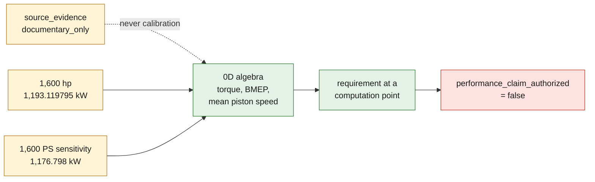

# 917/30 F9 power target contract

> **Archived line.** This contract belongs to the retired 917 work, kept as a
> numerical regression and not pursued as a product. See
> [ARCHIVE.md](../../ARCHIVE.md).

## Scope

F9 translates documentary power statements into reproducible algebraic
requirements. It computes, for several independent engine speeds, the torque,
the BMEP and the mean piston speed needed to reach a given power. This 0D model
is neither a thermodynamic solver, nor an engine curve, nor a bench result.

The contract remains deliberately blocked for any power claim. It computes no
air or fuel flow, no boost pressure, no temperature, no turbo speed and no
thermomechanical strength.

## Separating evidence from scenarios

The sourced facts are kept in `source_evidence`:

- the Porsche Museum record declares 5,374 cm³ and 882 kW / 1,200 PS;
- the Porsche Newsroom USA article describes a **reported** power of
  1,600 HP in qualifying configuration;
- the 90 × 70.4 mm geometry comes from the secondary source auto motor und
  sport. Its computation gives 5,374.385 cm³, consistent by rounding with the
  official 5,374 cm³.

These statements provide neither a torque–speed curve, nor a qualifying
duration, nor a power basis, nor an atmospheric correction, nor an uncertainty.
They therefore have the role `documentary_only` and are never used as
calibration.

Two computation scenarios remain separate:

1. primary Porsche USA scenario: 1,600 mechanical horsepower, with
   `1 hp = 745.6998715822702 W`, i.e. 1,193.119795 kW;
2. unit sensitivity: 1,600 metric PS, with `1 PS = 735.49875 W`, i.e.
   1,176.798 kW.

Both scenarios have their own torque and BMEP rows. The second neither corrects
nor replaces the Porsche statement in horsepower.



## Reproducible computation

```bash
make 917-performance-envelope-f9
```

The local output is written to
`work/917-performance-f9/power-requirement-envelopes.json`. The `work/`
directory stays outside Git.

The equations are:

- displacement: `π / 4 × bore² × stroke × number of cylinders`;
- required torque: `power × 60 / (2 × π × speed)`;
- four-stroke BMEP: `4 × π × torque / displacement`;
- mean piston speed: `2 × stroke × speed / 60`.

At 7,000 rpm, the primary 1,600 hp scenario algebraically requires
1,627.636 Nm and 38.057 bar of BMEP. The 1,600 PS sensitivity separately
requires 1,605.370 Nm and 37.537 bar. These values describe a requirement at a
computation point; they do not show that the engine can reach it. The grid from
6,000 to 8,000 rpm is not declared as an operating range.

## Fail-closed gate

The report keeps `performance_claim_authorized = false` as long as, in
particular, the following are missing:

- an identified thermodynamic solver, its version and its input set;
- the mass and energy balances;
- the calibration and independent validation sets;
- a speed–torque dynamometer trace and the bench calibration;
- the power basis and the correction standard;
- the qualifying duration, the ambient conditions and the uncertainty budget.

PhysicsNeMo remains reserved for a surrogate model built after validation of a
reference solver and correlation on physical tests held out from calibration.
F9 therefore never proves a power of 1,600 hp or 1,600 PS and authorizes no
manufacturing or loading of an engine.
