# 917 twin validation plan

> **Archived line.** The 917 twin is retired as a product and kept as a
> numerical regression; this plan is no longer being pursued. See
> [ARCHIVE.md](../../ARCHIVE.md).

## Levels

| Level | Content | Required to pass |
|---|---|---|
| F0 | raw scan and digest | provenance, license and identity documented |
| F1 | surfaces, envelope and visible interfaces | unit and three physical dimensions confirmed |
| F2 | semantic assembly | each subassembly identified and registered |
| F3 | internal volumes | CT, disassembly or direct metrology |
| F4 | thermal, structure and flow | materials, contacts and conditions measured |
| F5 | correlation | instrumented physical test and published uncertainty |

The current project stops at `F1_exterior_reference`. The display STL is a
product derived from F1 and does not advance engine fidelity.

```mermaid
stateDiagram-v2
  direction LR
  F0: F0 raw scan, digest
  F1: F1 exterior reference
  F2: F2 semantic assembly
  F3: F3 internal volumes
  F4: F4 thermal, structure, flow
  F5: F5 correlation
  [*] --> F0
  F0 --> F1: provenance, license, identity
  F1 --> F2: unit + 3 physical dimensions
  F2 --> F3: subassemblies identified
  F3 --> F4: CT, disassembly, metrology
  F4 --> F5: materials, contacts, conditions
  classDef stop fill:#fde2e1,stroke:#c0392b,color:#1a1a1a;
  classDef ok fill:#e3f1e6,stroke:#2e7d32,color:#1a1a1a;
  class F0,F1 ok
  class F2,F3,F4,F5 stop
```

*Green: where the project stops, `F1_exterior_reference`. Red: levels not
reached.*

## Display-model printing

1. check the physical dimension that sets the scale;
2. visually compare the closed STL with the reference scan;
3. measure the minimum details after scaling;
4. simulate supports, time, material and collisions in the real slicer;
5. print a test sector with fins, bore and studs;
6. correct the model before the full print.

For a metal display model, add trapped powder, supports, distortion, plate
removal, shot peening and possible machining. That does not turn the scan into a
functional engine design.

## External cooling CFD

The first case serves only to qualify the meshing chain. Before a solver:

1. repair the duplicate faces and the ambiguous surface connections;
2. locally refine the fins and the important air passages;
3. get `checkMesh` without failure;
4. confirm the scale, the orientation and the real flow direction;
5. define the flow rates, pressures and temperatures with their sources;
6. add the solid and the materials for a conjugate heat-transfer computation;
7. correlate pressure, flow and temperature on a physical test.

## Blocking data

- exact text of the Wolfe Classics license, redistribution right and an
  independent report on the declared accuracy of 0.5 mm;
- exact 917 variant represented and meaning of `0.5mm`;
- unit of the scan and at least three control dimensions;
- bill of materials of the two detached components;
- internal geometry, materials, masses and contacts;
- measured aerodynamic and thermal conditions.
