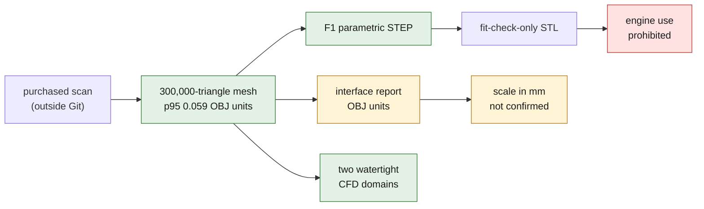

# Wolfe Classics 935 cylinder-head reference twin

> **Archived line.** The 935 scan is kept as a reference morphology, alongside
> the retired 917 work, and is not pursued as a product. See
> [ARCHIVE.md](../../ARCHIVE.md).

## Current scope

This directory holds the reproducible chain that turns the purchased scan into
working artifacts. The OBJ file, the derived meshes and the computation results
stay outside Git. The code and the method are versioned.

The twin is currently an `F1_interface_proxy`: it allows geometry review,
provisional measurement, collision checking and validation of the CFD meshing
chain. It does not yet represent a 993-compatible, functional or
ready-to-manufacture cylinder head.

## Artifacts produced

| Artifact | Use | Limit |
|---|---|---|
| immutable OBJ copy | traceability of the purchased scan | outside Git |
| 300,000-triangle mesh | segmentation and measurement | p95 simplification deviation 0.059 OBJ units |
| envelope without external elements | cylinder-head inspection | open sections, average classification |
| interface report | register, chamber, studs and openings | OBJ scale not confirmed |
| F1 parametric STEP | CAD datum and packaging check | simplified envelope |
| `fit-check-only` STL | non-functional polymer mock-up | prohibited in an engine |
| two watertight CFD domains | Gmsh validation and local studies | only the sections close to the flanges |
| three STEP/STL valve proxies | mass, collision and preparation of the dynamics | under-head profiles and grooves not measured; STL `fit-check-only` |



The 100,000-triangle version is rejected for metrology: its measured p95
deviation reaches about 6.15 OBJ units. It can only serve as a very coarse
preview.

## Valves and titanium variant

The pipeline now generates three F1 parametric geometries: 993 intake of 49 mm,
Carrera exhaust of 42.5 mm and Turbo exhaust of 43.5 mm, all with a declared
8 mm stem. The public values are kept with their evidence level; the intake
length remains an assumption of 109 mm derived from a product envelope of
110 mm.

The model compares the mass of the same volume with a generic steel density,
Ti-6Al-4V and, for the exhaust, INCONEL 751. The Special Metals documentation
describes 751 precisely as an alloy intended for exhaust valves, supplied as bar
and precipitation-treated. It does not validate an LPBF route. The titanium
variant is therefore the priority for the intake study; on the exhaust side it
remains a comparative case, to be challenged by temperatures, oxidation, wear
and hot fatigue.

```bash
docker run --rm --platform linux/amd64 --entrypoint /opt/venv/bin/python \
  -v "$PWD:/workspace" -w /workspace \
  ghcr.io/cluster2600/3dprinting993-mesh-cfd@sha256:a1db60cbf61bbcca52c171e50cab01ed0b6ec860b227e7c5fc50f7b809659b4f \
  twins/reference-935-cylinder-head/source/build_valve_variants.py \
  work/valve-variants-f1
```

The STEP files are editable simulation masters. The STLs carry the
`fit-check-only` notice and must never be fitted in an engine. A functional
valve requires at least the keeper groove, the under-head radius, the margin,
the seat angle and width, the guide clearances, the cam profile, the spring
curves, the moving masses, the treatment, the finish, and a dynamic and
thermomechanical validation.

## Local run

The Python environment must provide `trimesh`, `pymeshlab`, `scikit-image`,
`build123d`, `gmsh`, `numpy` and `scipy`.

```bash
PYTHON=/path/to/python \
  twins/reference-935-cylinder-head/run_pipeline.sh \
  raw-scans/wolfe-classics-935-cylinder-head/original/935-xtreme-cylinder-head.obj \
  work/wolfe-classics-935-cylinder-head/pipeline
```

The `3dprinting993-mesh-cfd` image adds Blender, Gmsh and OpenFOAM 13 for remote
computations. No scan is included in the image.

Once the Gmsh volumes are generated, their conversion and OpenFOAM check run
separately:

```bash
twins/reference-935-cylinder-head/source/check_openfoam_mesh.sh \
  work/wolfe-classics-935-cylinder-head/pipeline/cfd/high_B/fluid-domain.msh \
  work/wolfe-classics-935-cylinder-head/pipeline/openfoam/high_B
```

This check verifies the topology and geometry of the mesh. It is not yet a CFD
solution and invents no boundary condition.

## Provisional interfaces

The following values are expressed in OBJ units; millimeters are not yet
established:

- visible outer register: diameter 113.53;
- chamber shoulder at the chosen section: diameter 90.81;
- pattern of the four stud passages: about 86.74 × 85.92;
- mean visible diameter of the passages: 10.74;
- port opening, side B low: about 40 to 45.6;
- port opening, side B high: about 41.4 to 42.6.

These fits describe the visible mesh. The fit residuals are not a complete
metrological uncertainty. A physical dimension is needed to validate the scale,
and a scan does not automatically reveal the oil galleries, threads, seats or
guide bores.

## 993 comparison

The repository does not yet contain any verified 993 geometry for the stud
pattern, the cylinder registers, the flanges or the ports. The value of 100 for
the 993 bore comes from an OCR transcription not yet verified and does not
correspond to the same feature as the 113.53 register or the 90.81 shoulder. No
compatibility can therefore be concluded.

## Safety locks

- Never manufacture an engine version from the check STL.
- Never extrapolate the internal galleries from the external surface.
- Require a professional engineering review before any loaded cylinder head.
- Associate any metal version with a material, a process, a treatment, an
  orientation, machining, an inspection plan and material traceability.
- Keep the raw mesh and all its derivatives outside Git as instructed by the
  owner, even though the owner confirms an open, reusable license whose
  standardized identifier remains to be archived.
- Do not release a metal valve from the F1 proxies; require a complete
  definition, a material/process qualification and hot valvetrain tests under
  professional engineering review.
