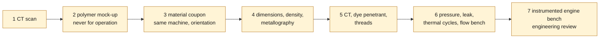

# Validation and improvement plan

> **Archived line.** The 935 scan is kept as a reference morphology and this
> plan is no longer being pursued. See [ARCHIVE.md](../../ARCHIVE.md).

## Objective

Build a digital twin able to compare variants without confusing a simulation
with evidence of operation. Every result must be registered against a physical
measurement before it serves a manufacturing decision.

## Twin levels

| Level | Model | Pass criterion |
|---|---|---|
| F0 | reference scan | provenance and digest verified |
| F1 | envelope and interfaces | scale, datums and physical dimensions checked |
| F2 | ports and internal volumes | CT or destructive measurement, watertight domains |
| F3 | thermal and structure | material, contacts and load cases justified |
| F4 | physical correlation | flow bench, pressure and temperature correlated |
| F5 | metal prototype | qualified process, machining and NDT inspections passed |
| F6 | engine test | instrumented protocol and professional review |

## Battery of numerical tests

1. **Geometry and metrology** — scan/CAD deviation map, flatness, coaxiality,
   center distances, minimum thicknesses, collisions and assembly tolerances.
2. **Cold CFD** — pressure loss, discharge coefficient, velocity uniformity,
   separation, swirl/tumble and sensitivity to valve lifts.
3. **Compressible CFD** — transient pressure and temperature on the turbo side;
   this case requires the real valve laws and engine conditions, absent to date.
4. **Conjugate heat transfer** — gas, metal, seats, guides, cylinder and air
   cooling; search for hot spots and gradients.
5. **Nonlinear structure** — stud tightening, contacts, cylinder pressure,
   expansion, deformation of the seats and gasket faces.
6. **Fatigue and creep** — thermomechanical cycles, high- and low-cycle
   fatigue, hot dwell and margins on manufacturing defects.
7. **Modal and vibration** — natural modes, engine excitation and strength of
   the fins or thin elements.
8. **Additive manufacturing** — orientation, supports, machining allowances,
   shrinkage, distortion, residual stresses, porosity and accessibility of
   trapped powder.
9. **Valve dynamics** — measured lift law, velocity and acceleration,
   cam/finger-follower contact, margin before float, seat bounce, groove and
   head stresses, sensitivity to Ti-6Al-4V, steel and nickel-alloy masses.
10. **Tribology and hot gases** — guide/stem clearance, lubrication, friction,
    seat wear, oxidation and thermomechanical fatigue. Ti-6Al-4V passes on the
    exhaust side only after temperature measurements and dedicated tests.

## Improvement loop

The admitted design variables will be limited to the zones whose geometry is
proven: section evolution, short-side radius of the port, transition to the
seat, guide boss, fins and local masses. The objectives will be multi-criteria:
reduce pressure loss and hot spots without degrading useful velocity,
combustion, stiffness, fatigue, machinability or mass.

A variant is retained only if it improves a Pareto front and respects the
constraints. A simple increase in peak flow is not a cylinder-head
optimization.

## Materials to compare

Aluminum must remain the thermal reference as long as the original material is
not identified. Ti-6Al-4V and Inconel 718 can be modeled as comparisons, but
their much lower thermal conductivity makes a complete cylinder head likely to
retain more heat. Inconel is more naturally a candidate near very hot exhaust
gases; titanium can be relevant for some inserts or lightened elements. Neither
may be chosen by default without a conjugate simulation, a seat architecture and
a cooling strategy.

## Physical validation before an engine test

1. CT scan of the part or of a reference cylinder head for internal voids;
2. polymer mock-up for assembly and accessibility, never for operation;
3. material coupon printed with the same machine, orientation and treatment;
4. dimensional measurement, density, metallography and mechanical test pieces;
5. CT inspection, dye-penetrant testing and thread inspection after machining;
6. pressure proof test, leak tightness, thermal cycles and flow bench;
7. test on an instrumented engine test bench, with automatic shutdown and
   engineering review.

*The seven physical steps, in the order the plan requires them before any engine
test. The diagram records a sequence, not progress.*

## Blocking data

- exact target 993 engine variant and reference geometry;
- unit of the scan and at least three physical control dimensions;
- CT internal geometry, seats, guides, threads and galleries;
- original material, mass, metallurgical state and measured temperatures;
- cam profiles, lifts, speeds, flow rates, pressures and temperatures;
- complete valve geometry, masses of retainers/keepers/springs, force–stroke
  curves, guide clearances and head/stem temperatures;
- cylinder pressure resolved in crank angle and stud preload;
- real capability of the metal machine, treatments and machining available.
